# 第一讲 熟悉 Unity 3D 开发环境

## 课程目的

熟悉 Unity 3D 的开发环境：

- 了解Unity3D的项目存储结构；
- 理解游戏项目的结构；
- 熟悉Uinty3D对场景和资源的管理；
- 理解Unity3D中组件与对象的关系；
- 掌握常用的视图变换操作。

## 一、熟悉开发环境

### 创建 Unity 项目

打开Unity Hub软件后，首先要新建一个项目。新建项目需要指定项目名称和项目路径、选择项目类型。开发三维交互软件或三维游戏一般选择“3D (Built-In Render Pipeline)”，之后点击创建进行项目的创建。

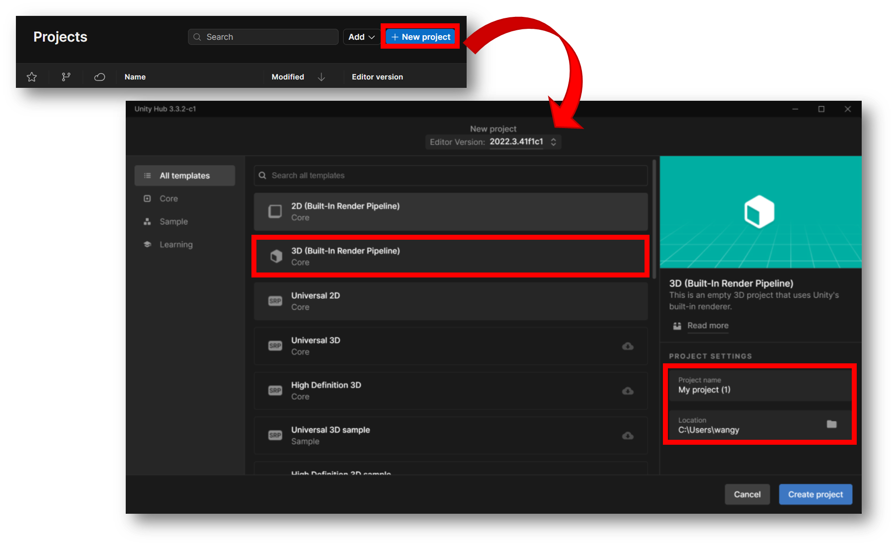
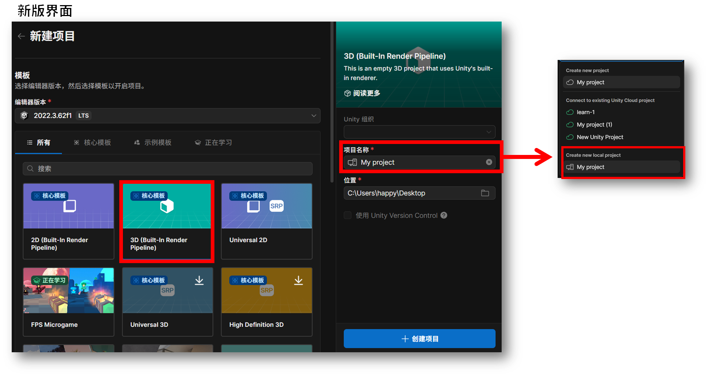

### 项目文件夹结构

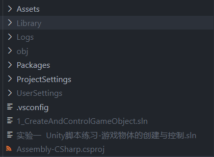

- <font color=red>Assets: 存放整个项目中用到的所有资源；</font>
- Library：库文件；
- ProjectSetting：项目设置文件；
- Packages：存放工程里的包配置文件。

**项目的打开：直接指定到项目文件夹路径**

### 软件界面

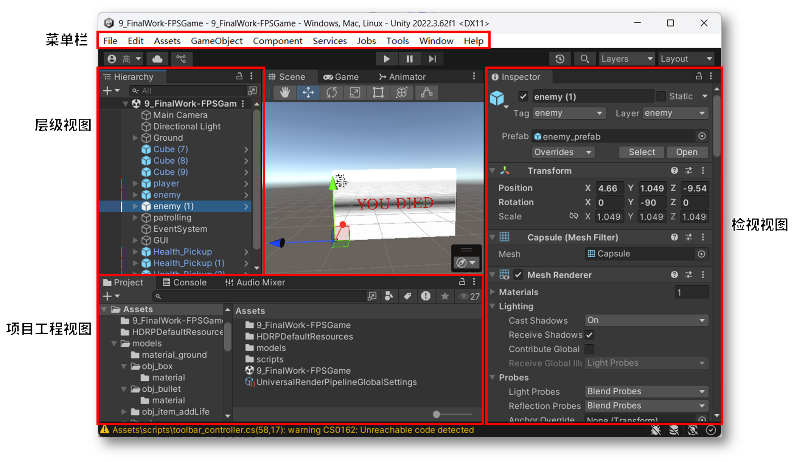

#### 项目工程视图(Project)

- 显示工程中所有的资源，也是文件夹Assets中的内容；
- 养成资源进行分类存放的习惯；
- 资源的导入尽量在Assets管理面板进行，不要直接操作Assets文件夹。

#### 层次视图(Hierarchy)：场景组成对象列表

层次视图(Hierarchy)主要用来显示游戏场景中的游戏对象和他们之间的层级关系，例如摄像机、基本几何体、模型、光源等。每次创建一个新的场景，默认都会有一个主摄像机。

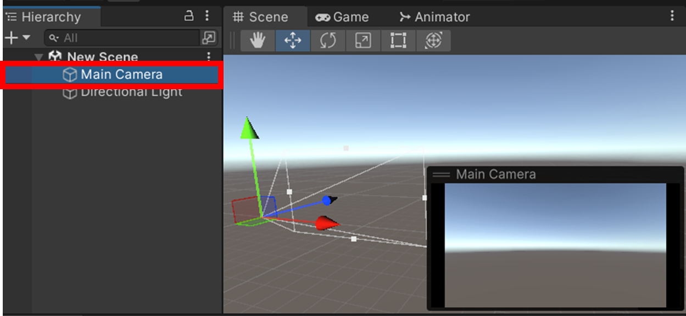

##### 创建游戏物体

Unity中提供了简单的几何形体，通过“菜单栏 > GameObject > 3D Object”菜单创建。

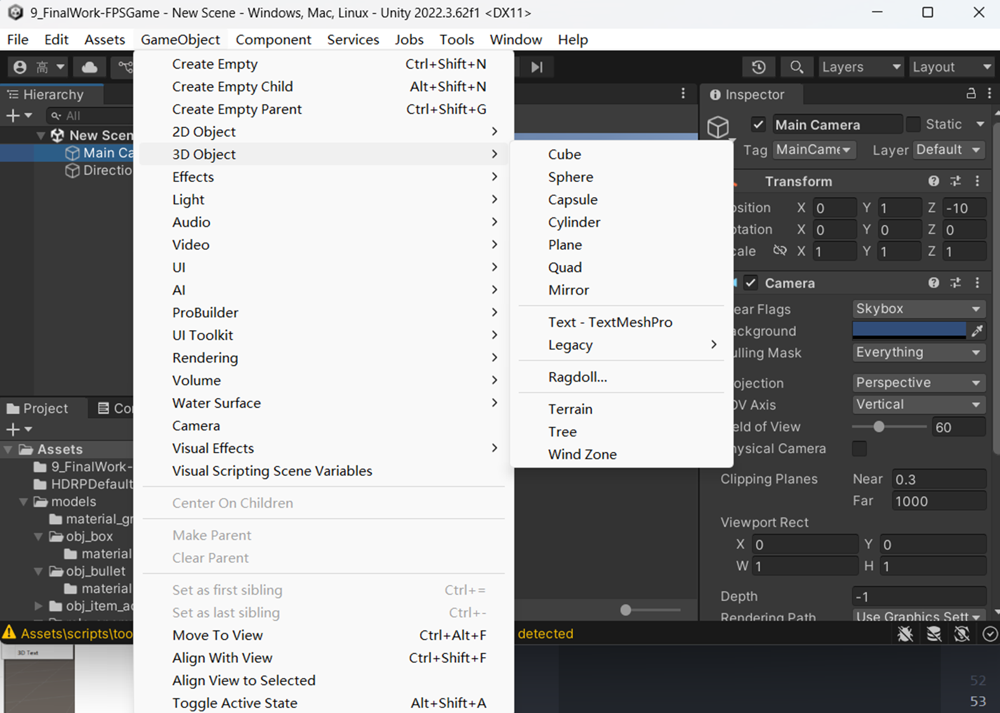

##### 理解游戏物体、游戏场景、游戏之间的关系

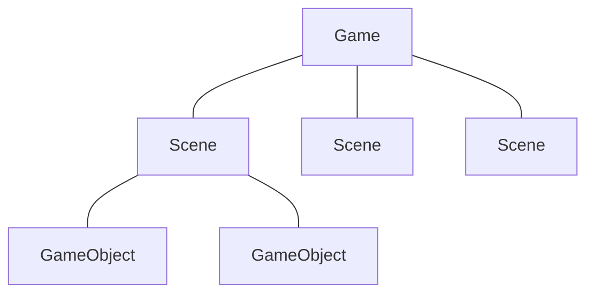

#### 检视视图(Inspector)：组件资源管理

- 在该视图中，详细列出了游戏对象上的所有组件和组件的参数，部分参数是可以动态修改的；

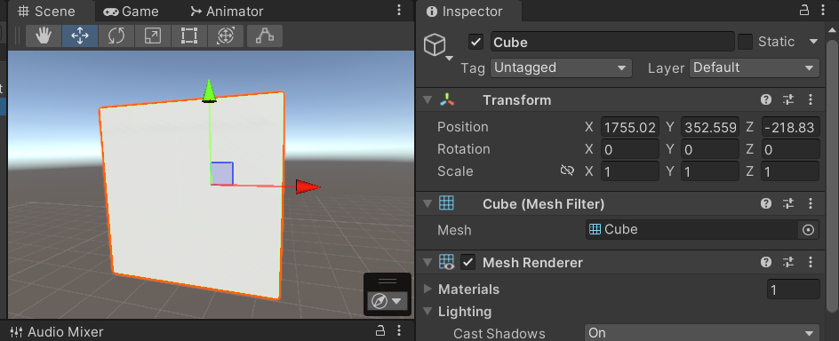

- 组件决定了对象的一切，游戏对象可以看成是组件的容器，组件的不同组合会得到不同的游戏对象，理解对象的属性由组件拼合而成；
- 游戏对象除了被当做各个组件的容器外，它还拥有Tag（标签）、Layer（层）和Name（名称）属性；
- 每个游戏对象不可能完全不包含组件，最少会有一个`Transform`组件，定义游戏对象在场景中的位置、旋转、缩放。

## 二、Unity 的基本操作

### 视图操作

- `鼠标右键`+`W`/`A`/`S`/`D`: 控制视角前后左右移动；
- `ALT`+`鼠标左`/`鼠标中`/`鼠标右`：旋转视角；
- 快速到达物体位置 ：选择物体，在场景中按`F`。

### 对象操作

快捷键`W`/`E`/`R`（平移、旋转、缩放）

### 子物体与父物体

任何游戏对象都可以成为其他游戏对象的父或子。一个对象想成为另外一个对象的子物体可以从层次图中将其拖动到父物体上，反之在父对象中将其拖拽出来就可以解除父子层级关系。

当对父对象进行诸如位移、旋转、缩放、层指定、启用/禁用等等操作时，可以直接影响子对象。

### 预制件与对象的关系

- 预制件：可以被重复使用的资源
- Prefab，意为预设体，可以理解为是一个游戏对象及其组件的集合，目的是为了使游戏对象及资源能够被重复使用。在Unity中，预设体作为一种资源存在。

通过一个预设体可以来创建相同的游戏对象，此过程可理解为实例化。

在项目工程视图中以蓝色立方体图标显示，空的预设体是白色立方体图标。当用预设体生成的游戏对象实例的时候，该游戏对象在层次视图中也会以蓝色字体显示。

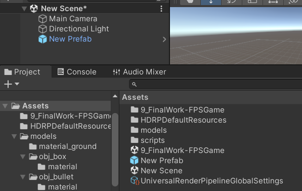

## 三、Unity 发布 PC 端游戏

### Build Settings：生成设置

1. File > Build Settings，弹出项目生成设置面板。

    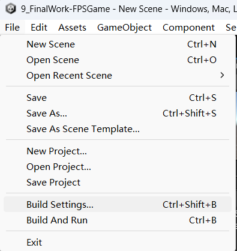

1. 选择要发布的平台；

    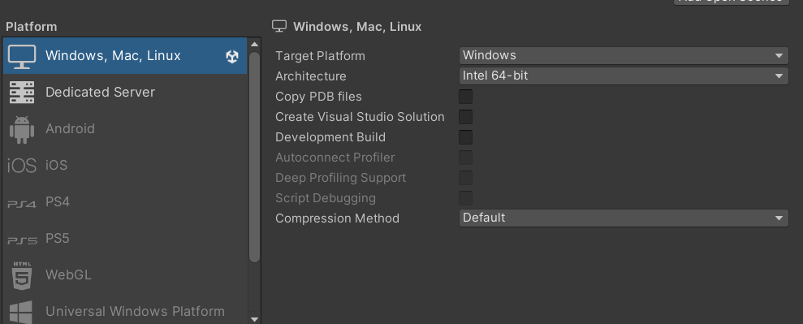

1. 添加要发布的场景。

    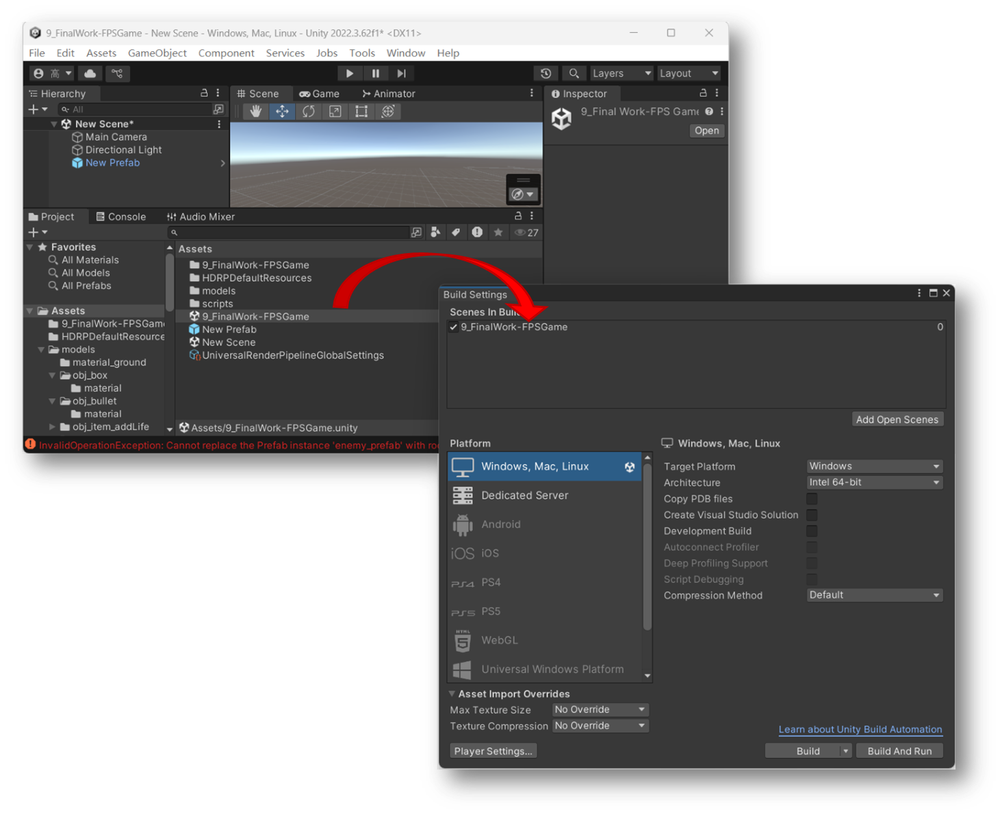

### Player Settings：详细设置

- Company：公司名称
- Product Name：产品名称（游戏名称）
- Default Icon：默认图标

### 成品文件介绍

一个 exe 可执行文件、一个 Data 数据文件夹，两者缺一不可且不可分割。

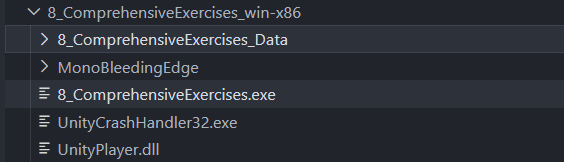

------

# 第二讲 Unity 脚本-游戏物体创建与操作

## 课程目的

1. Unity3D 脚本基础
    - 理解Unity3D 中脚本的作用
    - 掌握脚本的编写方式
    - 理解脚本和游戏对象的关系
1. 利用脚本控制游戏对象
    - 掌握使用脚本控制组件的方法
    - 创建游戏对象
    - 获取游戏对象
    - 克隆游戏对象

## 一、Unity 3D 脚本基础

### 脚本的作用

- 控制游戏对象的行为；
- 进行三维交互。

### 编写脚本语言

Unity 中脚本语言有：C#、JavaScript 。脚本是文本文件，可以用任
意的文本编辑器进行编辑。

通过 Edit > Preferences > External Tools 指定编辑工具。

### 新建脚本文件

一个脚本文件默认就是一个类，类的名称就是文件名，每个类都继承自
`MonoBehaviour`，`MonoBehaviour`是所有脚本的基类。

`MonoBehaviour`类中定义了各种回调方法：

- `Start()`函数能保证在第一次`Update()`被调用前调用；
- `Awake()`函数：脚本唤醒函数，无论脚本是否处于激活状态，当脚本绑定的游戏对象被激活时调用此函数。

> [!TIP]
>
> `Awake()`和`Start()`的区别在于，`Awake()`在加载场景时调用，在`Start()`方法之前，一般初始化的语句放在`Awake()`或者`Start()`中。

- `Update()`函数就是游戏每帧调用的刷新函数；
- `FixdUpdate()`固定更新函数，当我们需要在固定时间间隔完成一些动作的时候，需要使用此函数；
- `OnDestory()`：当前脚本销毁的时调用该函数；
- `OnEnable()`:当脚本激活的时候调用；
- `OnGUI()`：绘制界面的函数，在每一帧调用，现在一般用于测试功能。

### 绑定脚本

在 Unity 中创建该脚本后，需要绑定到某个`GameObject`中成为一个`Script`的组件（Component）后才能运行。
每个游戏对象可以绑定多个脚本，一个脚本也可以绑定到多个游戏对象上。

## 二、利用脚本控制游戏对象

### 游戏物体的平移，旋转和缩放

游戏对象的`Transform`组件，主要用于控制物体的旋转、移动、缩放。

- `position`：在世界空间坐标`transform`的位置；
- `Translate`函数：控制游戏物体位移的函数；

> [!TIP]
>
> `transform.Translate()`函数中，前一个变量是物体的移动速度，这里的速度是一个矢量，既包含大小写包含方向；
>
> 后一个变量是相对坐标系，这里的相对坐标系有两个值，一个是世界坐标，一个是自身坐标，如果第一个坐标不填写的话，默认为自身坐标系。
>
> 例如：
> `gameObject.transform.Translate(new Vector3(0,0.1f,0),Space.World);`

- `Rotate`函数，控制游戏物体的旋转；

    ```csharp
    gameObject.transform.Rotate(0.0f,10.0f,0.0f,Space.World);
    ```

- `Transform.RotateAround`围绕旋转；

    围绕世界坐标的`point`点的`axis`旋转该变换`angle`度。

- `transform.localScale`改变游戏物体的缩放比例。

### 访问游戏对象组件

- 添加组件时，用到`AddComponet()`方法；
- 获取游戏物体的组件时，使用`GetCompoent()`方法。

### 访问其他游戏对象

- 通过属性查看器指定游戏物体

    ```csharp
    public GameObject obj;
    ```

- 通过名字或者标签获取游戏物体

    ```csharp
    obj = GameObject.Find("游戏物体的名称");
    obj = GameObject.Find("父物体名称/子物体名称/…/游戏物体名称");
    obj = GameObject.FindWithTag("标签名称");
    obj = GameObject.FindGameObjectsWithTag("标签名称");
    ```

- 通过对象的层次关系

    可以通过`Transform`组件获取到子对象或者父对象：

    ```csharp
    gameObject.Transform.parent.Rotate(1,0,0);
    gameObject.transform.FindChild ("a").Rotate (10.0f, 0.0f, 0.0f);
    ```

### 克隆游戏对象（实例化）

克隆游戏对象和创建游戏对象在效果上呈现的方式是完全一样的，但从执行效率上来看，克隆对象的效率要高，类似于在场景中按下`Ctrl`+`D`复制对象。

克隆游戏对象更多通常用于实例投射物（如子弹、榴弹、破片、飞行的铁球等），AI 敌人，粒子爆炸或破坏物体的替代品。
克隆游戏对象通常和prefab 结合使用。

Prefabs（预设）是最非常用的一种资源类型，是一种可被重复使用的游戏对
象：

- 特点1：它可以被置入多个场景中，也可以在一个场景中多次置入。
- 特点2：当你在一个场景中增加一个Prefabs，你就实例化了一个Prefabs。
- 特点3：所有Prefabs实例都是Prefab的克隆，所以如果实在运行中生成对象会有“Clone”的标记。
- 特点4：只要Prefabs原型发生改变，所有的Prefabs实例都会产生变化。

#### Prefabs 的用法

如果需要创建一些想要重复使用的东西，就该用它了。使用`Instantiate()`方法克隆游戏对象。

```csharp
GameObject obj = Instantiate(Prefabsname);
```

## 小练习

1. 制作两个预制件，一个是cube，一个是sphere
1. 按下”克隆立方体”按钮，克隆cube
1. 按下“克隆球体”按钮，克隆sphere
