# 第三讲 Unity脚本-工具类与输入控制

## 课程目的
1. 掌握游戏编程的常用工具类的使用
    - 掌握`Time`类的用法
    - 掌握随机类`Random`的用法
    - 掌握`Mathf`类的用法
2. 掌握输入控制的方法
    - 掌握键盘的输入控制
    - 掌握鼠标的输入控制
    - 自定义输入控制

## 一、常用工具类

### 向量类

3D游戏开发中经常需要用到向量与向量类，在Unity中，和向量有关的类有`Vector2`、`Vector3`、`Vector4`，分别对应不同维度的向量，其中`Vector3`的使用最为广泛。

#### `Vector3`类中的常量

| 名称             | 值                |
|:----------------:|:-----------------:|
|`Vector3.forward` |`Vector3(0, 0, 1)` |
|`Vector3.right`   |`Vector3(1, 0, 0)` |
|`Vector3.up`      |`Vector3(0, 1, 0)` |
|`Vector3.zero`    |`Vector3(0, 0, 0)` |
|`Vector3.one`     |`Vector3(1, 1, 1)` |

#### `Vector3`类中的方法

##### `MoveTowards()`从当前位置移向目标位置

函数原型为：

```csharp
public static Vector3 MoveTowards(Vector3 current, Vector3 target, float maxDistanceDelta);
```

作用是将当前值`current`移向目标`target`。（对`Vector3`是沿两点间直线）。`maxDistanceDelta`就是每次移动的最大长度。

返回值是`current`值加上`maxDistanceDelta`的值，如果这个值超过了`target`，返回的就是`target`的值。

> **举例：**
>
> 一个物体朝着另一个物体的位置移动。如下图所示的场景，红色小方块向蓝色小方块移动。脚本cubeAct.cs绑定在红色小方块上。
>
> 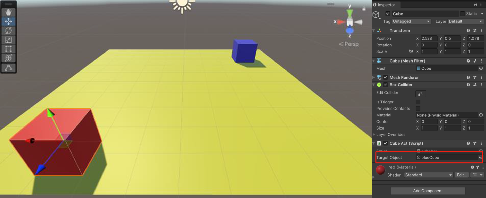
>
> ```csharp
> public class cubeAct : MonoBehaviour
> {
>   Vector3 current, target;
>   public GameObject targetObject; //在组件面板指定为蓝色小方块
> 
>   // Update is called once per frame
>   void Update()
>   {
>       current = gameObject.transform.position;
>       target = targetObject.transform.position;
>       gameObject.transform.position = Vector3.MoveTowards(current,target,0.1f);
>   }
> }
> ```

##### `Distance()`返回两点之间的距离

函数原型为：

```csharp
public static float Distance(Vector3 a, Vector3 b);
```

描述：返回`a`和`b`之间的距离。

> **举例：**
>
> 在上例中，加入距离判断，让红色小方块在蓝色小方块前方停下：
>
> ```csharp
> void Update()
> {
>   current = gameObject.transform.position;
>   target = targetObject.transform.position;
>   if (Vector3.Distance(current,target)>2)
>       gameObject.transform.position = Vector3. MoveTowards(current,target,0.1f);
> }
> ```

##### `Lerp()`线性插值

`Lerp()`方法传入两个向量对象，第三个参数为间断值（几分之几，范围是0-1），返回一个计算后得到向量，具体计算得到返回值也就是 $a+(b-a)\cdot t$ 。

例如：

```csharp
gameObject.transform.position = Vector3.Lerp (gameObject.transform.position, obj.transform.position, 0.01f);
```

### `Time`类

`Time`类用来进行时间控制。它的常用属性：

1. `Time.realtimeSinceStartup`：从游戏开始计时，运行的真实时间，以秒为单位。不受`Time.scale`的影响；
1. `Time.time`：从游戏开始计时，截止到目前，运行的游戏时间，以秒为单位，受到`Time.scale`的影响，是变化的时间；
1. `Time.timeScale`：时间流逝的速度，值在0-100之间。
    - 当取值为1时，表示和现实时间一致；
    - 当取值为2时，表示真实时间1秒，对应游戏时间2秒；
    - 如果为0.5，表示真实时间1秒，对应游戏时间0.5秒。

    可以通过`Time.timeScale`来控制游戏的暂停，和游戏的速度。`timeScale`不影响`Update`和`LateUpdate`，会影响`FixedUpdate`。

    > **举例：**
    >
    > 控制立方体的旋转
    >
    > 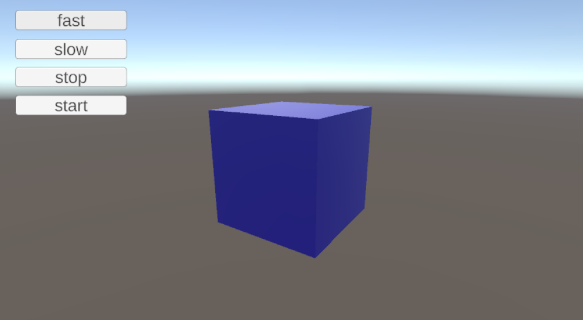
    >
    > ```csharp
    > public class timescaleTest : MonoBehaviour
    > {
    >     float s;
    > 
    >     // Start is called before the first frame update
    >     void Start()
    >     {
    >         s = Time.timeScale;
    >     }
    >
    >     // Update is called once per frame
    >     void Update()
    >     {
    >     }
    >
    >     void FixedUpdate()
    >     {
    >         gameObject.transform.Rotate(Vector3.up * 0.5f);
    >     }
    >
    >     public void fast_btn()
    >     {
    >         s += 0.1f;
    >         Time.timeScale = s;
    >     }
    >
    >     public void slow_btn()
    >     {
    >         s -= 0.1f;
    >         if (s < 0) s = 0;
    >             Time.timeScale = s;
    >     }
    >
    >     public void start_btn()
    >     {
    >         s = 1.0f;
    >         Time.timeScale = s;
    >     }
    >
    >     public void stop_btn()
    >     {
    >        s = 0f;
    >        Time.timeScale = s;
    >     }
    > }
    > ```

1. `Time.deltaTime`：上一帧消耗的时间，表示距上一次调用`Update`或`FixedUpdate`所用的时间。因此通过它可以让游戏对象按照一个常速进行旋转，而不是依赖于它的帧频，如果想要一个值根据每帧的变化而变化（增加或减少），使用`Time.deltaTime`来乘以这个值，使得变化的效果依赖于单位时间，而不是帧频。这不仅使得游戏的运行独立于帧频，也使得运动的效果符合现实。

    ```csharp
    function Update() 
    { 
        //让游戏物体每秒旋转5度 
        tranform.Rotate(0, 5 * Time.deltaTime, 0);
    } 
    ```

    同样地移动效果：

    ```csharp
    function Update() 
    { 
        //让游戏物体每秒移动2米
        transform.Translate(0, 0, 2 * Time.deltaTime); 
    }
    ```

1. `Time.fixedTime`：只读参数，返回从游戏启动到现在以固定频率更新的时间。也是每次执行`fixedUpdate()`函数的时间间隔。

> [!TIP]
>
> **`UpDate()`与`FixedUpdate()`的区别**
>
> 因为`Update()`受当前渲染的物体，更确切的说是三角形的数量影响，有时快有时慢，帧率会变化，`Update()`被调用的时间间隔就发生变化。
>
> 但是`FixedUpdate()`则不受帧率的变化，它是以固定的时间间隔来被调用，这个时间间隔可以通过如下方法设置：“Edit->Project Setting->time”下面的“Fixed timestep”。

6. `Time.fixeddeltaTime`：固定频率更新时，相邻两帧的时间间隔。

### `Random`随机数类

随机数类`Random`是Unity中生成随机数的类。

1. `Random.value`返回一个0-1之间的随机数；
1. `Random.Range()`函数，第一个参数是随机数的最小值，第二个参数是随机数的最大值，两个参数决定了生成随机数的区间。

    > **举例：**
    >
    > 随机选择一个数组元素相当于选择一个介于零和数组最大索引值（等于数组的长度减一）之间的随机整数。这可以通过使用内置的`Random.Range`函数轻松完成。
    >
    > ```csharp
    > var element = myArray[Random.Range(0, myArray.Length)];
    > ```
    >
    > 请注意，`Random.Range`返回一个包含第一个参数但不包含第二个参数的范围的值，因此这里使用`myArray.Length`可以得到正确的结果。
    >
    > 例如：一个常见的游戏机制是从一组已知的项目中选择，但以随机顺序获得。
    >
    > 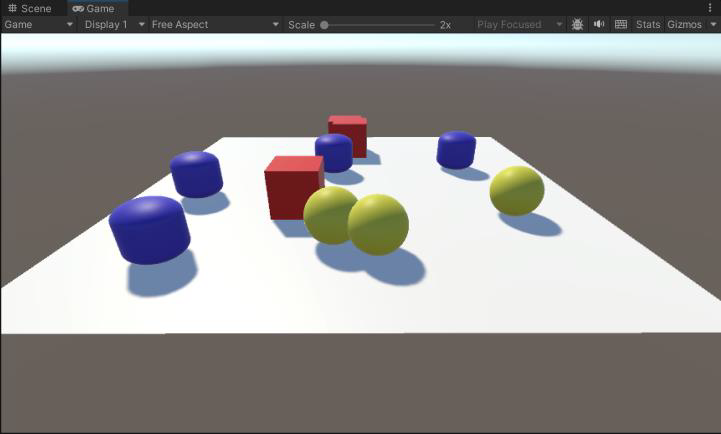
    >
    > ```csharp
    > 
    > public class randomTest : MonoBehaviour
    > {
    >   public GameObject[] props;
    >   
    >   // Start is called before the first frame update
    >   void Start()
    >   {
    >       for (int i = 0; i < 10; i++)
    >       {
    >           GameObject obj = Instantiate(props[Random.Range(0, props.Length)]);
    >           obj.transform.position = new Vector3(Random.Range(-4.5f, 4.5f), 0.5f, Random.Range(-4.5f, 4.5f));
    >       }
    >   }
    > }
    > ```

1. `Random.insideUnitSphere`返回一个`Vector3`的三维坐标，坐标位置在半径为1的球内；
1. `Random.onUnitSphere`返回一个`Vector3`的三维坐标,坐标位置在半径为1的球体表面。

### `Mathf`数学类

1. `Mathf.Abs`绝对值：计算并返回指定参数 f 绝对值。
1. `Mathf.Clamp01`限制0~1。

    ```csharp
    static function Clamp01 (value : float) :float
    ```

    限制`value`在0~1之间并返回`value`：
    
    - 如果`value`小于0，返回0；
    - 如果`value`大于1，返回1，否则返回`value`。

1. `Mathf.Clamp`限制

    ```csharp
    static function Clamp (value : float, min :float, max : float) : float
    ```

    限制`value`的值在`min`和`max`之间：
    
    - 如果`value`小于`min`，返回`min`；
    - 如果`value`大于`max`，返回`max`，否则返回`value`。

### 协同程序和中断

#### 协程的概念

协同程序（Coroutine）简称协程，是伴随主线程一起运行的程序片段，是一个**能够暂停执行的函数**，用于解决程序并行问题。协程是C#中的概念，由于Unity3D的渲染操作是基于帧实现的，使用线程（Thread）不便于控制，因此 Unity3D选择使用协程实现并发效果。

协程是一个能够暂停执行的函数，在收到**中断指令**后暂停执行，并立即返回主函数，执行主函数剩余的部分，直到中断指令完成后，从中断指令的下一行继续执行协程剩余的部分。函数体全部执行完成，协程结束。协程能保留上一次调用时的状态，每次过程重入时，就相当于进入上一次调用的状态。由于中断指令的出现，使得**可以将一个函数分割到多个帧里执行**。

#### 中断指令

Yield中断：有中断就代表程序停在该处，等待yield后的条件满足再继续执行后面的语句。

```csharp
// 协程在所有脚本的FixedUpdate执行之后,等待一个fixed时间间隔之后再继续执行 
yield return WaitForFixedUpdate(); 

// 协程将在下一帧所有脚本的Update执行之后,再继续执行 
yield return null; 

// 协程在延迟指定时间,且当前帧所有脚本的 Update全都执行结束后才继续执行 
yield return new WaitForSeconds(seconds); 

// 与WaitForSeconds类似, 但不受时间缩放影响 
yield return WaitForSecondsRealtime(seconds); 

// 协程在WWW下载资源完成后,再继续执行 
yield return new WWW(url); 

// 协程在指定协程执行结束后,再继续执行 
yield return StartCoroutine(); 

// 当返回条件为假时才执行后续步骤 
yield return WaitWhile(); 

// 等待帧画面渲染结束
yield return new WaitForEndOfFrame();
```

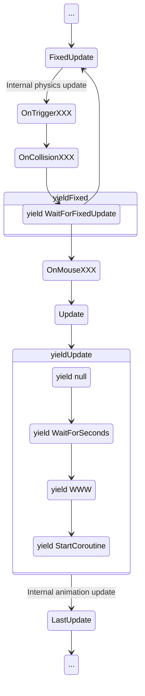

#### 开启和启动协程

在Unity3D中，使用`MonoBehaviour.StartCoroutine`方法即可开启一个协同程序，也就是说该方法必须在`MonoBehaviour`或继承于`MonoBehaviour`的类中调用。使用`StopCoroutine(string methodName)`来终止一个协同程序，使用`StopAllCoroutines()`来终止所有可以终止的协同程序。

> **举例：**
> 
> 每5秒生成一个预制件
>
> ```csharp
> void Start () 
> { 
>     StartCoroutine (func()); 
> }
>
> IEnumerator func()
> { 
>     for (int i = 0; i < 10; i++) 
>     { 
>         GameObject g = Instantiate (obj); 
>         g.transform.position = new Vector3 (Random.Range (-5, 5), Random.Range (0, 2), Random.Range (-5, 5)); 
>         yield return new WaitForSeconds (5); 
>     } 
> }
> ```

> **举例：**
>
> 巡逻协程：在三个位置之间（🟠）顺序切换巡逻。
> 
> 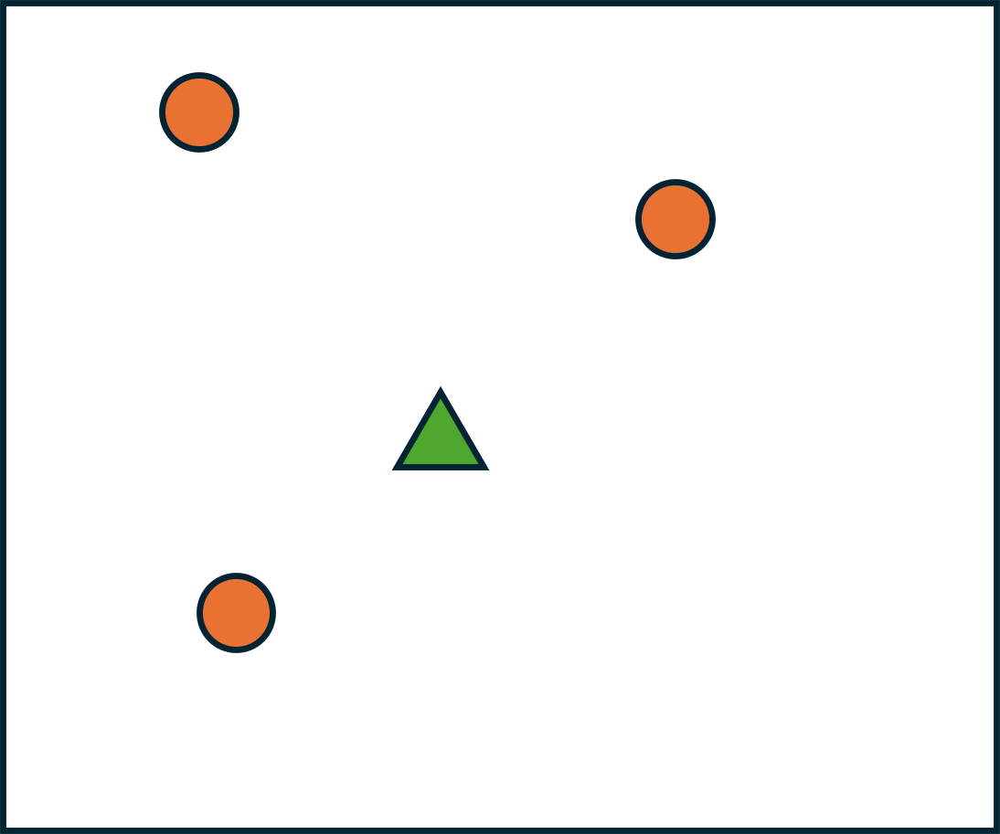
>
> ```csharp
> public class around : MonoBehaviour 
> { 
>     public GameObject[] pos; GameObject targetPos; 
>
>     // Start is called before the first frame update 
>     void Start() 
>     { 
>         StartCoroutine(AINavMesh()); 
>     }
>
>     // Update is called once per frame 
>     void Update() 
>     { 
>     } 
>
>     IEnumerator AINavMesh() 
>     { 
>         int num = pos.Length; 
>         int i = 0; 
>         targetPos = pos[i];
>         
>         while(true) 
>         { 
>             if (Vector3.Distance(transform.position, targetPos.transform.position) < 0.01f) 
>             { 
>                 i = (i + 1) % num; 
>                 targetPos = pos[i]; 
>                 yield return new WaitForSeconds(2.0f); 
>             }
>            
>             transform.position = Vector3.MoveTowards(transform.position, targetPos.transform.position, 0.05f); 
>             
>             yield return new WaitForEndOfFrame(); 
>         } 
>     } 
> }
> ```

## 二、输入控制

Unity 的输入系统支持多种输入设备，比如键盘和鼠标，游戏手柄，触摸屏，VR 和 AR 控制器等等。

Unity 通过两个独立的系统提供输入支持：第一，输入管理器(Input Manager) 是 Unity 核心平台的一部分，默认情况下可用，属于旧的unity 输入系统；第二，输入系统(Input System) 是一个包，必须先通过Package Manager 进行安装后才能使用，属于新的Unity 输入系统。我们课程仍然还是从旧的输入系统Input Manager 开始。

### Input Manager

#### 键盘输入控制

1. `Input.GetKeyDown()`：如果按键被按下，该方法将返回`true`，没有按下则返回`false`。

    例如：

    ```csharp
    if (Input.GetKeyDown(KeyCode.A))
    {
        Debug.Log("您按下了A 键");
    }
    ```

1. `Input.GetKeyUp()`方法得到抬起事件。方法和按下事件相同。

    例如：

    ```csharp
    if (Input.GetKeyUp(KeyCode.A))
    {
        Debug.Log("您抬起了A 键");
    }
    ```

1. 监听键盘中某个按键是否一直处于被按下的状态，使用`Input.GetKey()`方法来判断。

    例如：

    ```csharp
    if (Input.GetKey (KeyCode.A))
    {
        Debug.Log("您长按A 键");
    }
    ```

1. 使用`Input.anyKeyDown()`监听任意键按下事件，例如，游戏处于待机状态，按下任意键激活游戏。

> **举例：**
>
> 用上下左右箭头，控制小方块的漫游。
>
> 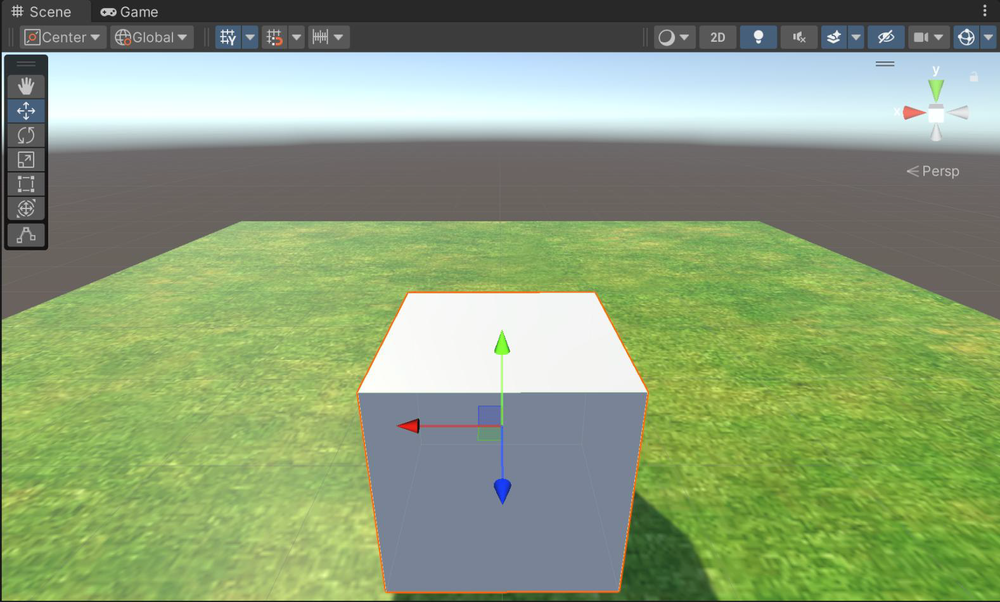
>
> ```csharp
> void Update()
> {
>     if (Input.GetKey(KeyCode.DownArrow))
>         transform.Translate(Vector3.forward * 5.0f * Time.deltaTime);
> 
>     if (Input.GetKey(KeyCode.UpArrow))
>         transform.Translate(Vector3.back * 5.0f * Time.deltaTime);
> 
>     if (Input.GetKey(KeyCode.LeftArrow))
>         transform.Rotate(Vector3.up * -25.0f * Time.deltaTime);
> 
>     if (Input.GetKey(KeyCode.RightArrow))
>         transform.Rotate(Vector3.up * 25.0f * Time.deltaTime);
> }
> ```

#### 鼠标输入控制

1. `Input.GetMouseButton()`鼠标长按事件
1. `Input.GetMouseButtonDown()`鼠标按下事件
1. `Input.GetMouseButtonUp()`鼠标抬起事件

    参数：0代表鼠标左键、1代表鼠标右键、2代表鼠标中键。

    > **举例：**
    > 
    > 鼠标按下朝前方发射一颗子弹。
    >
    > 
    >
    > 步骤：
    > 
    > 1. 制作子弹预制件，注意添加`RigidBody`组件，并将`mass`设置为`0.001`；
    > 1. 添加如下脚本。
    >
    > ```csharp
    > public class bullet : MonoBehaviour
    > {
    > public GameObject Bullet;
    > 
    >     // Start is called before the first frame update
    >     void FixedUpdate() {
    >         if (Input.GetMouseButtonDown(0))
    >         {
    >             GameObject bullet_obj = Instantiate(Bullet);
    >             bullet_obj.transform.position = new Vector3(0, 2.0f, 5);
    >             bullet_obj.GetComponent<Rigidbody>().AddForce(Vector3.back * 10.0f);
    >         }
    >     }
    > }
    > ```

1. `Input.mousePosition`：获取鼠标在屏幕上的位置，这是一个`Vector3`类型的值，表示当前鼠标在屏幕上的位置。位置的`x`和`y`值表示鼠标在屏幕上的像素坐标，`z`值通常为0（在2D空间中）。
1. `Input.mouseScrollDelta`：这是一个`Vector2`类型的值，表示自上一帧以来鼠标滚轮的滚动量。`x`值表示水平滚动，`y`值表示垂直滚动。

#### 虚拟轴输入

虚拟轴输入可以设置输入设备类型名称，输入键位等参数，用于解决计算机与其他的输入设备的兼容。

Unity 允许创建自定义的虚拟轴，虚拟按键是虚拟轴的特殊情况，在Input Manager中统一视为虚拟轴。选择菜单栏中的 编辑（Edit） > 项目设置（Project Settings） > 输入（Input） 可以打开Input Manager。

Unity 默认创建了18个虚拟轴，每个轴的属性如下：

- `Name`是虚拟轴的名称，通过**Name**在脚本中访问虚拟轴，可以为不同的设备指定同名的虚拟轴，输入来自于用户正在使用的那个设备，在写脚本时，无需考虑输入来自于哪里；
- `Negative Button`轴的负按键对应的物理按键；
- `Positive Button`轴的正按键对应的物理按键；
- `Alt Negative Button`备选负按键；
- `Alt Positive Button`备选正按键；
- `Gravity`当键松开后，轴复位的速度，越大表示越快复位；
- `Dead`死亡区间，在此区间的值都会被认为是复位值，即0；
- `Sensitivity`灵敏度，对按键来说是响应速度，与`Gravity` 相对，对鼠标来说是单位时间内移动距离的影响；
- `Snap`选中后，当按下反方向键后，值立刻复位；如果不选中，原方向值不会立刻归0，会有一个减速到0 的过程；
- `Invert`选中后，正负按键颠倒；
- `Axis`这个虚拟轴所映射的设备输入轴（摇杆、鼠标、手柄等）；

在脚本中通过以下方法获取虚拟按键事件：

```Input.GetButtonUp(string buttonName)```

```Input.GetButtonDown(string buttonName)```

```Input.GetButton(string buttonName)```

获取轴输入：

- `Input.GetAxis(string axisName)`：输入轴的值一般在-1到1之间；
- `Input.GetAxisRaw(string axisName)`：返回1、0、-1。

> **综合案例：**
> 
> 实现敌人对主角的主动追击，本案例在前面协同程序的案例增加对主角的追击效果，当主角进入追击范围，敌人感知到主角并追击，主角离开追击范围，敌人返回继续巡逻。
>
> 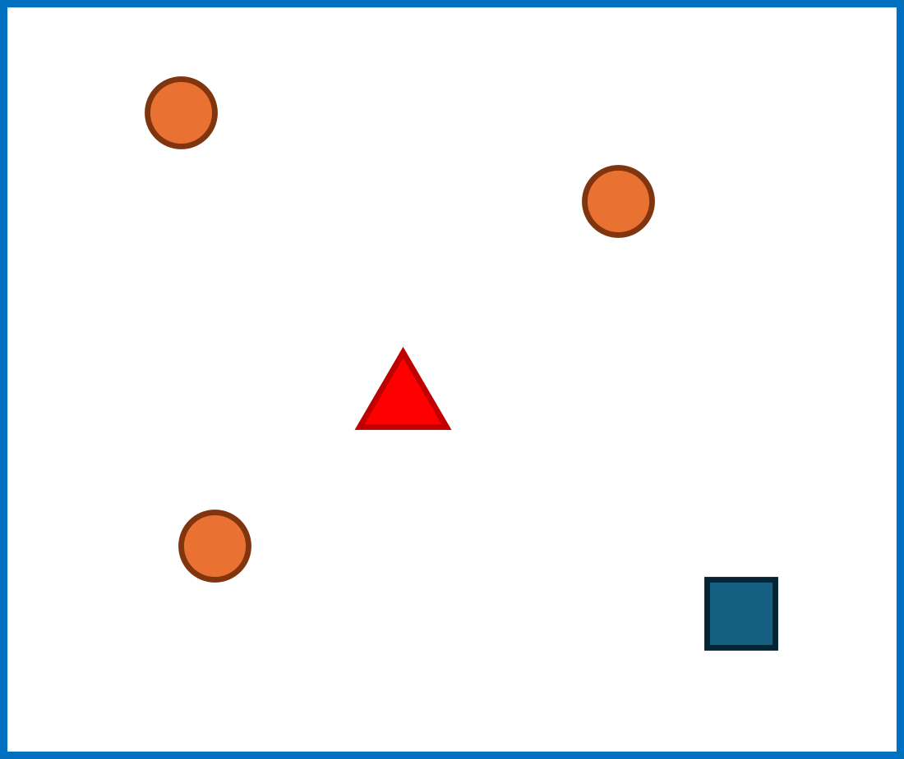
>
> - 🔺：敌人，在三个位置（🟠）之间顺序切换巡逻，并在主角进入攻击范围内，对主角进行追击；
> - 🟦：主角，在场景中漫游。
>
> 主角的漫游控制代码：
>
> ```csharp
> void Update()
> {
>     transform.Translate(Input.GetAxis("Vertical") * Vector3.forward * -8.0f * Time.deltaTime);
>     transform.Rotate(Input.GetAxis("Horizontal") * Vector3.up * 30.0f * Time.deltaTime);
> }
> ```
>
> 敌人控制代码：
>
> ```csharp
> public class around : MonoBehaviour
> {
>     public GameObject[] pos;
>     public GameObject player;
>     GameObject targetPos;
>     
>     // Start is called before the first frame update
>     void Start()
>     {
>         StartCoroutine(AINavMesh());
>     }
> 
>     // Update is called once per frame
>     void Update()
>     {
>     }
> 
>     IEnumerator AINavMesh() {
>         int num = pos.Length;
>         int i = 0;
>         targetPos = pos[i];
> 
>         while(true)
>         {
>             if (Vector3.Distance(transform.position, targetPos.transform.position) < 0.01f)
>             {
>                 i = (i + 1) % num;
>                 targetPos = pos[i];
>                 yield return new WaitForSeconds(2.0f);
>             }
>             
>             if(Vector3.Distance(transform.position,player.transform.position)< 15.0f)
>             {
>                 yield return StartCoroutine(FollowPlayer());
>             }
> 
>             transform.position = Vector3.MoveTowards(transform.position,
>             targetPos.transform.position, 0.05f);
>             yield return new WaitForEndOfFrame();
>         }
>     }
> 
>     IEnumerator FollowPlayer() {
>         while (true)
>         {
>             if (Vector3.Distance(transform.position, player.transform.position) > 15.0f)
>                 yield break;
> 
>             transform.position = Vector3.MoveTowards(transform.position,
>             player.transform.position, 0.05f);
>             yield return new WaitForEndOfFrame();
>             
>         }
>     }
> }
> ```

### Input System*

新输入系统Input System是2019年推出的插件。随着Unity的不断发展，开发者对于项目的输入系统要求也日益提高。在进行多平台适配和跨平台移植时，常常需要改变输入系统，这给开发者带来了不少困扰。而Unity官方推出的Input System插件，则是为了解决这一问题而推出的全新输入方式。

相较于旧版的Input Manager，Input System的操作虽然更为繁琐复杂，但在应对跨平台项目时，面对不同的输入方式，Input System的输入映射机制为开发者提供了巨大的便利。

#### 安装Input System插件

Unity默认使用旧的Input Manager，新的Input System处于未启用状态。打开包管理器（窗口（Windows） > 包管理器（Package Manager）），在“Unity Registry”中找到Input System插件，如下图所示。

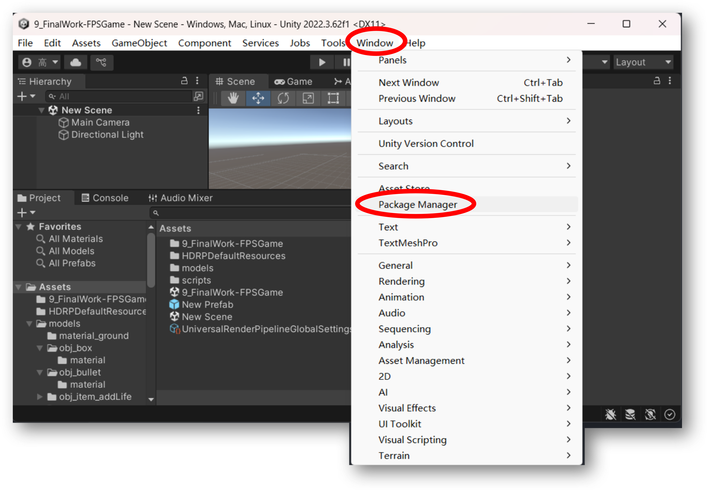

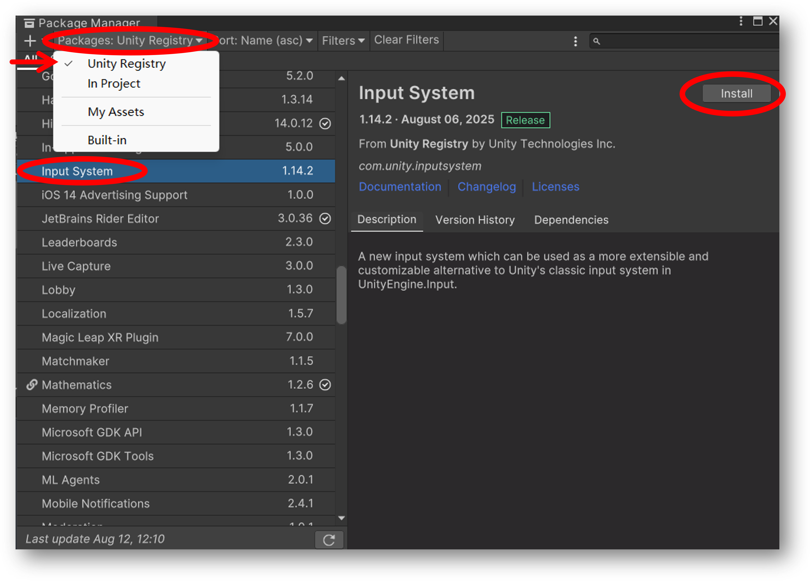

我们当前工程中就已经存在新的输入系统了。为了能够确认我们的工程中使用的那种输入系统，我们可以在 编辑（Edit） > 项目设置（Project Settings） 窗口中的 玩家（Player） 选项进一步来核实。

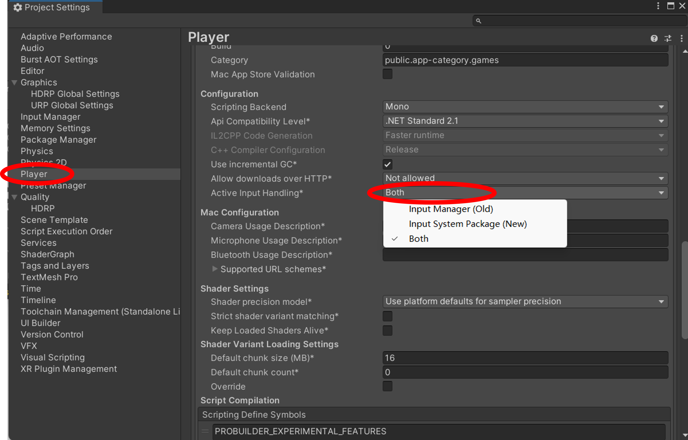

在“Active Input Handing”一项中显示“Input System Package(New)”表示使用新的Input System 输入系统。还可以选择“Input Manager(Old)”或“Both”。“Input Manager(Old)”是旧的Input Manager 输入系统，而“Both”就是新旧输入系统都可以同时使用。

#### 使用可视化编辑器

通过Project > Create > Input Actions可以创建一个Input Action，创建Input Actions。成功后双击打开Input Actions 编辑页面。

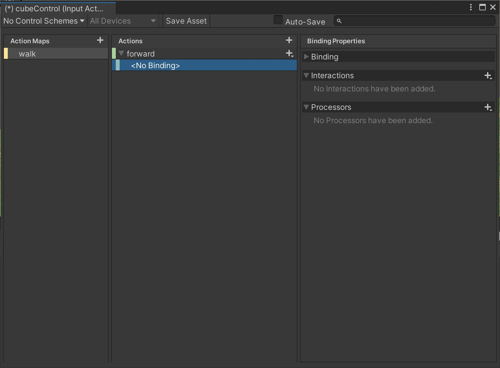

##### Action Map：行为映射表

一个Input Actions可以有多个Map。每个Map 下面又有许多Action，可以批量控制Action 启用与禁用。例如：有一个UI Map, 包含选项的上、下、左、右、确定等功能，我们将这些功能绑定在方向键。另一个Player Map，控制主角的移动，绑定的同样是方向键。为了避免功能冲突，我们可以在打开UI面板的时候，禁用Player Map，关闭UI面板时，禁用UI Map，启用Player Map。以及其他类似的操作。

切换不同输入系统的代码如下：

```csharp
// 切换操作映射
public void SwitchActionMap(InputActionMap actionMap)
{
parameter.inputSystem.Disable(); // 禁用当前的输入映射
actionMap.Enable(); // 启用新的输入映射
}
// 调用
SwitchActionMap(parameter.inputSystem.Player); // 切换到游戏操作的输入映射
SwitchActionMap(parameter.inputSystem.UI);//切换为UI 输入
```

##### Action：输入行为

Action是指一个具体的输入动作，比如按键按下、鼠标移动等，它可以理解成是自定义的输入行为（动作）的集合。一个Action 可以由一种或者多种输入信号组成。比如“前进”这个动作，可以被“`W`”键触发，也可以被“`↑`”方向键触发，也可以被手柄的“`↑`”键触发。

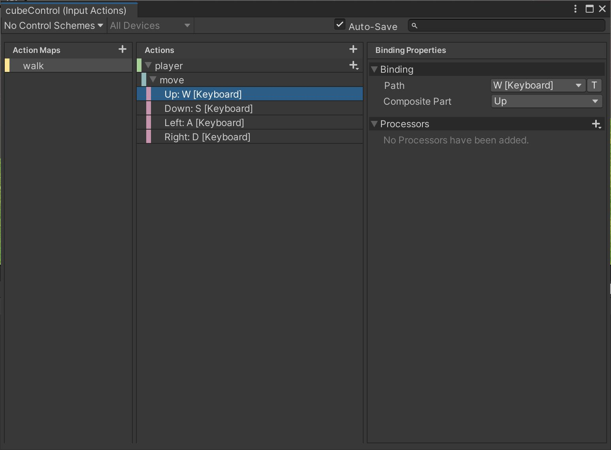

##### 添加控制脚本

创建好的`InputActions`后，我们可以在`InputActions`属性面板中找到“Generate C# Class”并勾选,随后点击“Apply”生成对应的脚本，之后我们就可以在我们自己写的`PlayerController`类中调用该脚本了：

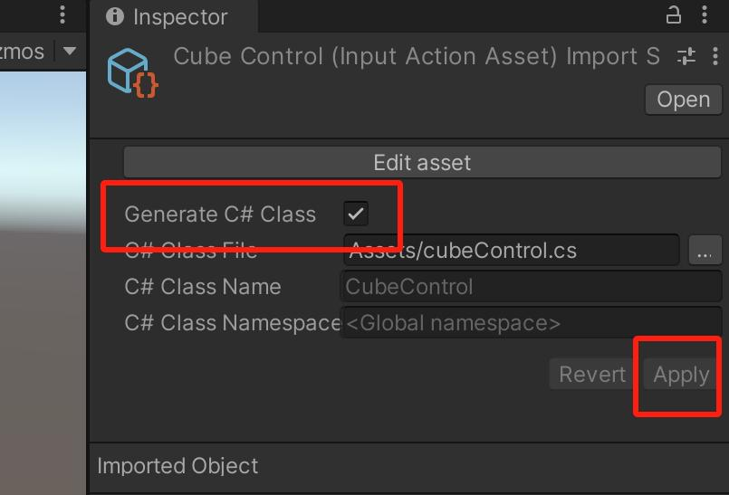

添加如下的代码：

```csharp
public class cubeMove : MonoBehaviour
{
    // Start is called before the first frame update
    public CubeControl cubecontrol;
    void Start()
    {
        cubecontrol = new CubeControl();
        cubecontrol.Enable();
    } 
    
    // Update is called once per frame、
    void Update()
    {
        Vector2 moveVector2 = cubecontrol.walk.player.ReadValue<Vector2>();
        transform.Translate(moveVector2.x, 0.0f, moveVector2.y);
    }
}
```
