# 第四讲 摄像机与地形编辑器

## 课程目的

1. 掌握摄像机的使用
    - 理解Unity3D中摄像机的参数
    - 掌握摄像机的灵活使用
    - 理解层的概念
    - 掌握天空盒的使用
2. 掌握地形编辑器的使用方法

## 一、摄像机

摄像机是用于将世界场景投影到屏幕的设备。如电影中使用摄像机向观众展现故事一样，Unity中的摄像机用于向玩家展示游戏世界。在场景中至少要有一个摄像机，但也可以有多个摄像机。在场景中放置多个摄像机，它们可以设定成任意的渲染次序，渲染到屏幕上的任意地方。多个摄像机可以提供双人分屏或营造高级自定义效果。可以将摄像机动画化，也可以通过物理方式来控制摄像机。

摄像机也可以被定制，绑定脚本或者挂载到其他游戏物体上面以获得想象中的各种效果。例如，对于猜谜的游戏，只需对游戏的全部视图保持摄像机静止即可。对于第一人称的射击游戏，常会将摄像机挂载到玩家角色上面，将其放置在角色眼睛的高度。对于赛车游戏，会让摄像机跟随赛车。

### 摄像机的属性

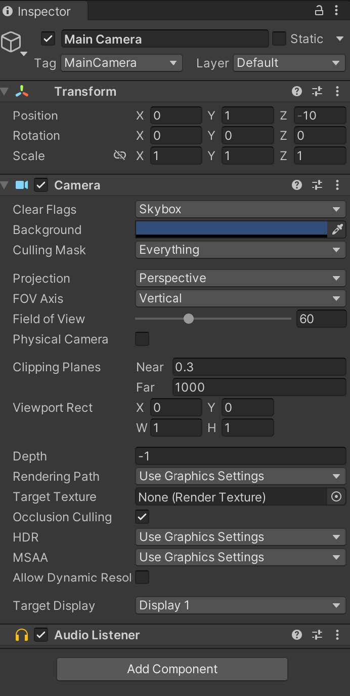

#### Clear Flags

清除标记。每个相机在渲染其视图时都会存储颜色和深度信息。屏幕中未绘制的部分为空，默认情况下将显示天空盒。使用多个相机时，每个摄像机都会在缓冲区中存储自己的颜色和深度信息，随着每个相机渲染而累积越来越多数据。场景中的任何特定相机渲染其视图时，可以指定清除标记来清除不同的缓冲区信息集合。

- Skybox：天空盒，默认项，屏幕的任何空白部分都将显示当前相机的天空盒；
- Solid Color：空白区域以纯色显示，该颜色在摄像机的Background Color中指定；
- Depth only：仅深度，该模式用于对象不被裁剪，保留了前一个摄像机的画面，但清除了之前所有的深度信息，可以用于混合两个摄像机看到的画面；
- Don’t clear：不清除，此模式既不清除之前渲染的画面，也不清除深度信息。结果是将每帧绘制在下一帧之上，从而产生涂抹效果。此模式通常不用于游戏，更可能与自定义着色器一起使用。

##### 天空盒

###### 天空盒是什么？

天空盒是一个全景视图，分为六个纹理，表示沿主轴（上，下，左，右，前，后）可见的六个方向。如果天空盒被正确地生成，那么纹理图片的边缘将会被无缝地合并，在里面的任何方向看，都会是一副连续的画面。全景图在场景中所有其他对象物体之后被渲染，并且旋转以匹配Camera的当前方向（它不会随着相机的位置而变化，相机的位置总是被视为在全景图的中心）。因此，使用天空盒一种是将现实感添加到场景的简单方法，并且图形硬件的负载最小。

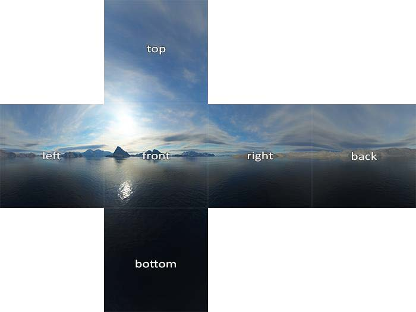

##### 天空盒的使用

###### 制作天空盒材质

首先准备5张图片（一般只需要包含：top，left，right，front，back等5张图片即可）。将图片的Wrap Mode属性修改为Clamp。

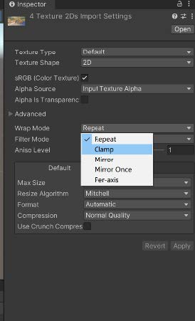

在Assets面板点击右键，选择create，选择Material，创建一个材质球，重命名为SkyBox，点击SkyBox，在SkyBox Shader处选择：Skybox > 6 Sided。

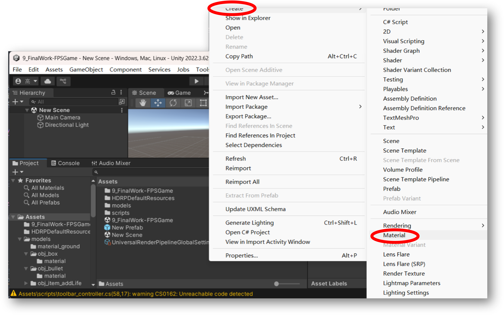

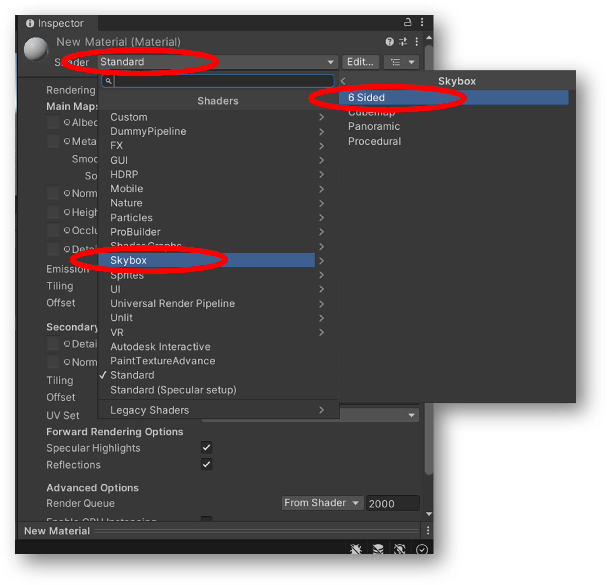

出现如下界面，需要在Front、Back、Left、Right、Up者5处填充照片

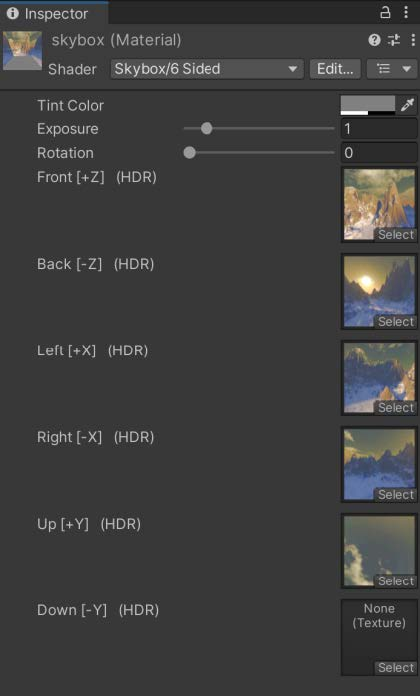

###### 在场景中绘制天空盒

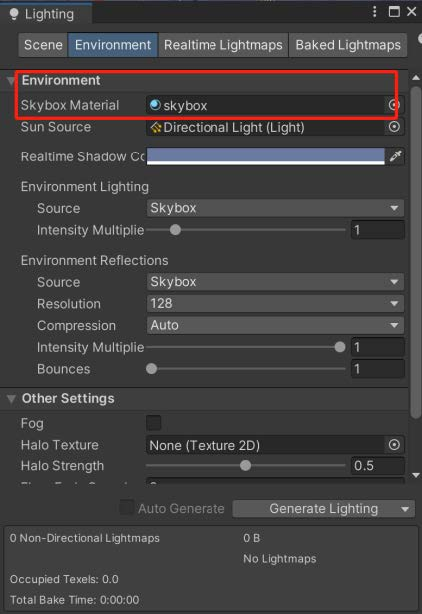

创建天空盒材质后，可以在场景中渲染该材质。为此需要执行以下操作：

1. 从菜单栏中，单击 Window > Rendering > Lighting Settings。
2. 在随后出现的窗口中，单击 Environment 选项卡。
3. 将天空盒材质分配给 Skybox Material 属性。

这样会在场景内每个摄像机的背景中绘制天空盒。

###### 为特定摄像机绘制天空盒

如果只想在特定摄像机的背景中绘制天空盒，可以使用 **Skybox** 组件。将此组件附加到带有摄像机的游戏对象时，它会覆盖摄像机绘制的天空盒。要附加并设置 Skybox 组件，请执行以下操作：

1. 选择场景中的一个摄像机，然后在 Inspector 窗口中进行查看。
2. 单击 Add Component > Rendering > Skybox。
3. 在 Skybox 组件中，将天空盒材质分配给 Custom Skybox 属性。

#### Culling Mask

用于来设定是否剔除处于某一层的对象。Unity场景中的每一个用于来设定是否剔除处于某一层的对象。Unity场景中的每一个对象，都被分配了一个层，默认为“default”层。打开层级管理器可以看到初始状态下分配了8个层，即0-7层是已经被U3D使用，而“default”处于第0层。

实际应用中，我们常常采用Culling Mask制作空气墙。

#### Projection

摄像机的投影方式，有透视投影和正交投影两种。

- Perspective：透视投影，近大远小，一般用于3D，视野范围是一个平截头体；
- Orthographic：正交投影，视野范围是一个长方体。

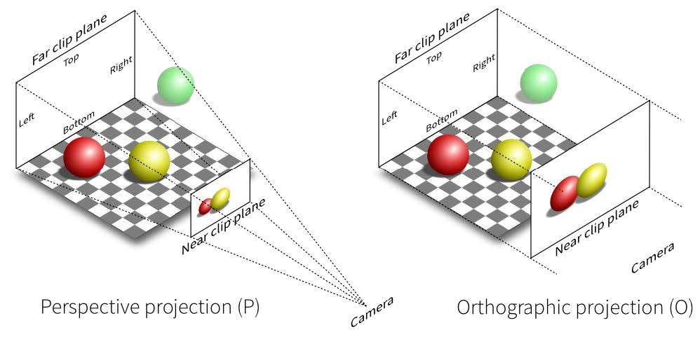

#### Field of view

视角，透视投影时才有的特性。视角越大，能看到的视野也越大，对应的焦距也越短。

#### Clipping Planes

裁剪平面，Near和Far指定了裁剪的区域范围，即在Near-Far范围之内的面将被裁剪掉，不进行渲染。

远近裁剪平面和由Field Of view决定的平面一起构成一个椎体，被称为相机椎体或视椎体，完全处于该椎体之外的物体将会被剔除，这被称为椎体剔除。

#### viewport rect

- `X`：摄像机视图在屏幕上被绘制的水平初始位置
- `Y`：摄像机视图在屏幕上被绘制的垂直初始位置
- `W`：摄像机视图输出图像占屏幕宽度的比例
- `H`：摄像机视图输出图像占屏幕高度的比例

指定相机的画面位于屏幕中的哪个位置，默认是全屏，采用比例的方式来确定，因此值为0~1，屏幕左下角是`(0,0)`，右上角是`(1,1)`。

- `X`,`Y`：表示相机画面的左下角的位置；
- `W`,`H`：相机画面的长宽，0.5表示屏幕的一半，0.2表示屏幕的0.2 U3D屏幕的坐标系是以左下角为坐标原点，向右为X轴，向上为Y轴。

> [!IMPORTANT]
>
> U3D屏幕的坐标系是以左下角为坐标原点，向右为X轴，向上为Y轴。

> **举例：**
> 
> 实现小地图的效果
>
> 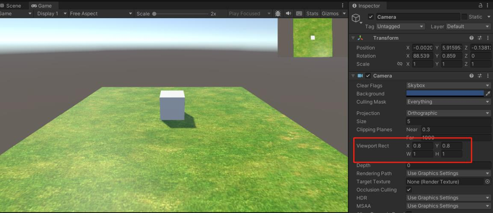

> **举例：**
> 
> 实现分屏的效果
>
> 

#### Depth

摄像机在绘制序列中的位置（层级）。有更大深度值的摄像机将会在深度值更小的摄像机上面绘制，即假如两个相机C1和C2，深度值分别为10和8，假如将摄像机设为在场景中可见，则C1会在C2的上层绘制。 

> **举例：**
> 
> 切换镜头：在不同的场景或情况下切换不同的摄像机视角。可以通过调整多个摄像机的深度来实现切换效果。例如，可以在游戏中设置多个摄像机，分别用于主视角、第三人称视角和小地图视角，然后根据玩家的操作或游戏状态切换不同的摄像机。
>
> ```csharp
> public class transition : MonoBehaviour 
> { 
>     // Start is called before the first frame update
>     public GameObject c1, c2, c3;//定义三个不同角度的摄像机 
>     
>     // Update is called once per frame 
>     void Update() 
>     { 
>         if (Input.GetKeyDown(KeyCode.Q)) 
>         { 
>             c1.GetComponent<Camera>().depth = 1; 
>             c2.GetComponent<Camera>().depth = 0; 
>             c3.GetComponent<Camera>().depth = 0; 
>         } 
>         
>         if (Input.GetKeyDown(KeyCode.W)) 
>         { 
>             c1.GetComponent<Camera>().depth = 0;
>             c2.GetComponent<Camera>().depth = 1; 
>             c3.GetComponent<Camera>().depth = 0; 
>         } 
>         
>         if (Input.GetKeyDown(KeyCode.E)) 
>         { 
>             c1.GetComponent<Camera>().depth = 0; 
>             c2.GetComponent<Camera>().depth = 0;
>             c3.GetComponent<Camera>().depth = 1; 
>         } 
>     } 
> }
> ```


### 摄像机的应用举例

摄像机的震动：模拟摄像机的震动效果，如爆炸、撞击等。可以通过在脚本中随机改变摄像机的位置和旋转来实现震动效果。

以下是一个简单的摄像机震动脚本示例：

```csharp
public class CameraShake : MonoBehaviour 
{ 
    public float shakeDuration = 0.5f; 
    public float shakeMagnitude = 0.1f; 
    private Vector3 originalPosition; 
    private Quaternion originalRotation; 
    private float shakeTimer;

    void Start() 
    { 
        originalPosition = transform.position; 
        originalRotation = transform.rotation; 
    }

    void Update() 
    {
        if (Input.GetKeyDown(KeyCode.Space)) 
            Shake();
        if (shakeTimer > 0) 
        { 
            transform.position = originalPosition + Random.insideUnitSphere * shakeMagnitude;
            transform.Rotate( Random.Range(-shakeMagnitude, shakeMagnitude), 
                              Random.Range(-shakeMagnitude, shakeMagnitude), 
                              Random.Range(-shakeMagnitude, shakeMagnitude) ); 
            shakeTimer -= Time.deltaTime; 
        } 
        else 
        { 
            transform.position = originalPosition; 
            transform.rotation = originalRotation; 
        } 
    }
    
    public void Shake() 
    { 
        shakeTimer = shakeDuration; 
    }
}
```

> **举例：**
> 
> 摄像机跟随：使摄像机跟随一个特定的目标物体移动，如玩家角色。可以通过计算目标物体的位置和摄像机的位置之间的差值，然后逐渐移动摄像机来实现平滑的跟随效果。
> 
> 以下是一个简单的摄像机跟随脚本示例：
>
> ```csharp
> public class CameraFollow : MonoBehaviour
> {
>     public Transform target;
>     public float smoothSpeed = 0.125f;
>     public Vector3 offset;
>
>     void LateUpdate()
>     {
>         Vector3 desiredPosition = target.position + offset;
>         Vector3 smoothedPosition = Vector3.Lerp(transform.position, desiredPosition, smoothSpeed);
>         transform.position = smoothedPosition;
>         transform.LookAt(target);
>     }
> }
> ```

## 二、地形引擎

### 创建地形

通过菜单 GameObject > 3D Object > Terrain 可以在场景中添加地形。

### 地形参数

地形一旦创建完毕后，Unity3D会默认地形的大小，宽度，厚度，图像分辨率，纹理分辨率，等等，这些数值是可以修改的。常用的参数如下：

- Terrain Width: 地形的宽度；
- Terrain Height: 地形的高度；
- Terrain Length:地形的长度。

### 编辑地形

选中Terrain游戏对象，其属性面板中会出现Terrain组件和Terrain Collider组件，如下图。前者负责地形的编辑功能，后者是地形的物理碰撞器。

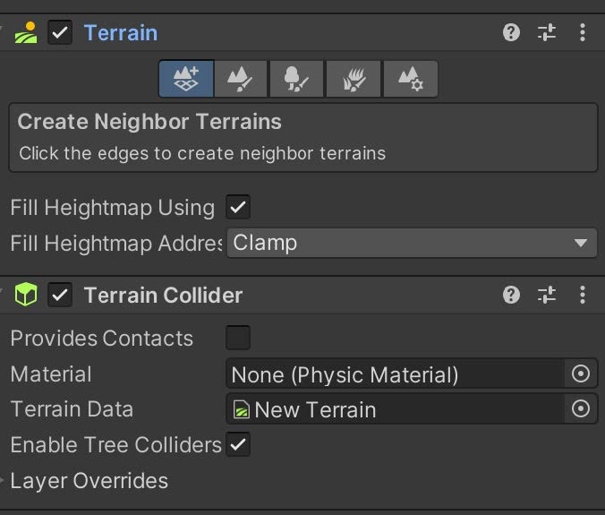

Terrain组件包含5个按钮，分别是Create Neighbor Terrain创建附近的地形，Paint Terrain绘制地形，Paint Tree绘制树，Print Detail绘制细节，以及刚才我们调整大小时碰到的Terrain Setting地形设置。

- **Create Neighbor Terrains** 工具用于快速创建自动连接的相邻地形瓦片。在 Terrain Inspector 中，单击 Create Neighbor Terrains 图标。

    选择此工具时，Unity 会突出显示所选地形瓦片周围的区域，指示可以在哪些空间内放置新连接的瓦片。

    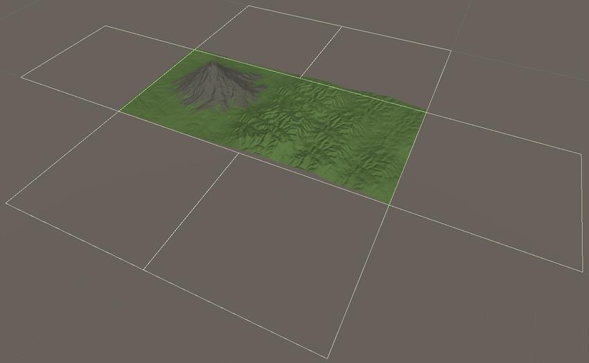

    选中 Fill Heightmap Using 可使用相邻地形瓦片的高度贴图交叉混合来填充新地形瓦片的高度贴图，从而确保新瓦片边缘的高度与相邻瓦片匹配。

- **Paint Terrain** 工具用于绘制地形，如下图所示：

    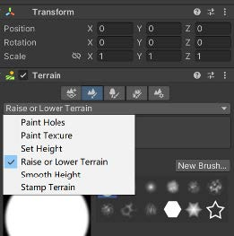

    它提供六种不同的工具：

  - Raise or Lower Terrain：使用画笔工具绘制高度贴图。
  - Paint Holes：隐藏地形的某些部分。
  - Paint Texture：应用表面纹理。
  - Set Height：将高度贴图调整为特定值。
  - Smooth Height：平滑高度贴图以柔化地形特征。
  - Stamp Terrain：在当前高度贴图之上标记画笔形状。

- **Paint Trees** 工具可用于绘制树。
  
    树的模型可以在[Unity Store](https://store.unity.com/)下载免费资源。

- **Paint Details** 工具可用于绘制草等细节。
