# 第五讲 Mecanim动画系统

## 课程目的

1. 理解骨骼动画的原理
2. 掌握Mecanim动画系统的使用
3. 掌握动画的融合

Mecanim把游戏中的角色设计提高到了一个新的层次，使用Mecanim可以通过Retargeting（重定向）来提高角色动画的重用性。用户可以使用动画状态机来处理动画之间的过渡及动画之间的逻辑。

Mecanim支持运动重定向（Retargeting）功能：即把动画从一个角色模型应用到另一个角色模型上的功能。

## 一．模型的准备

Unity3D支持下面几种模型格式的文件导入：

- fbx
- obj
- max
- mb
- blend

Unity不能制作3D模型和进行骨骼绑定，这些需要在专业的建模软件中由美术进行制作，一般常用的建模软件有下面几种：

- 3DMax
- Maya
- Cinema 4D
- Blender
- Mixamo

当美术制作好了资源以后，我们只需要将这些资源导入到Unity3D中使用即可。

在资源面板选中模型之后，在组件面板会显示出模型的属性参数，这些参数分为三组，分别是model，rig和animations。

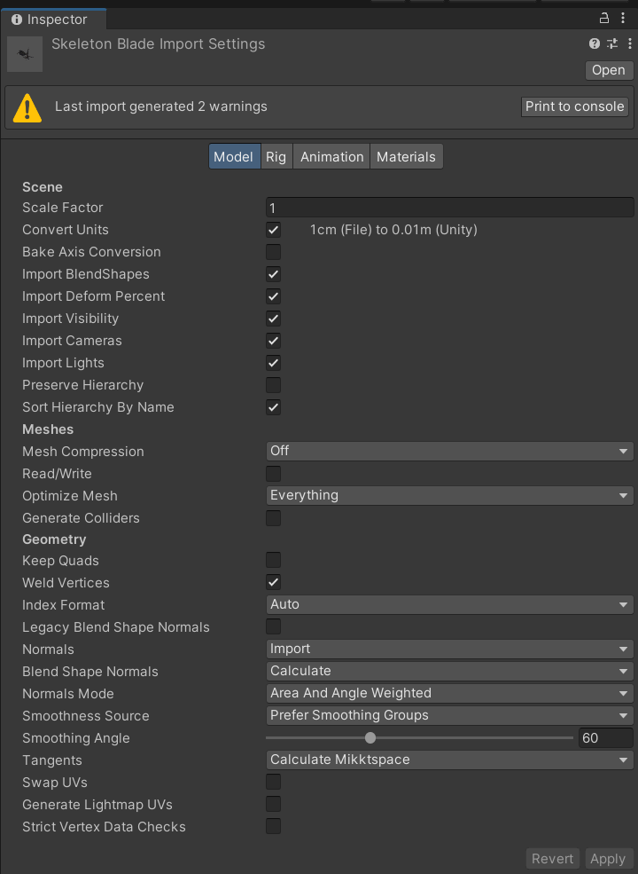

### 模型设置（model）

Model是模型的基本设置，常用的有：

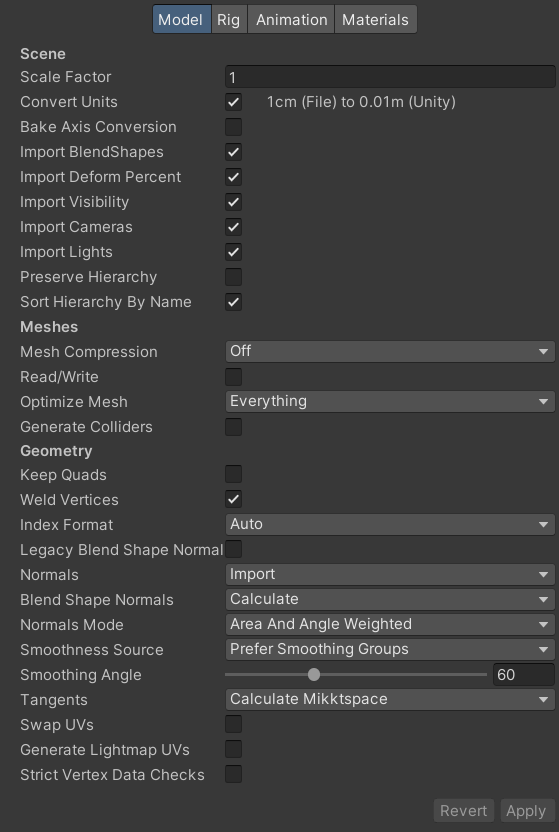

- Scale Factor 缩放比例；
- Mesh Comparession 模型压缩；
- Generate Collifers 是否生成碰撞体；
- Import Materials 是否导入材质。

### 骨骼设置（Rig）

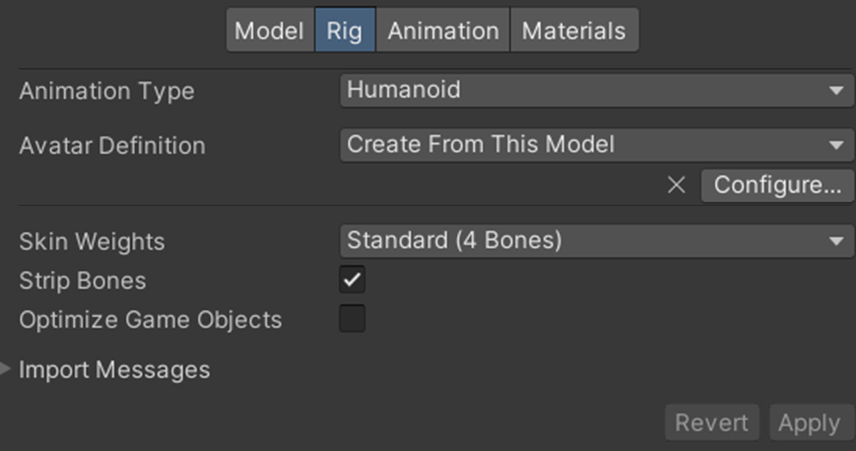

- Animation type 骨骼的类型；
- Avatar Definition 骨骼映射方法。

#### 生成Avatar

将角色的骨骼转化为可识别的一般骨骼或者人形骨骼

有的人形动画的骨骼都大致相似，比如头，胳膊，腿等，唯一不同的可能是骨骼的数量不同。所以Unity为我们建立一套标准的骨骼，我们需要把自己的骨骼映射到标准骨骼中，这样我们就可以实现人形动画的重用（不同人物的动画通用）。

#### 如何配置Avatar

首先查看骨骼的映射是否正确，Unity会自动为我们配置一遍，一般是没有问题的，但也需要我们确认一遍

这个是建模时的骨骼：

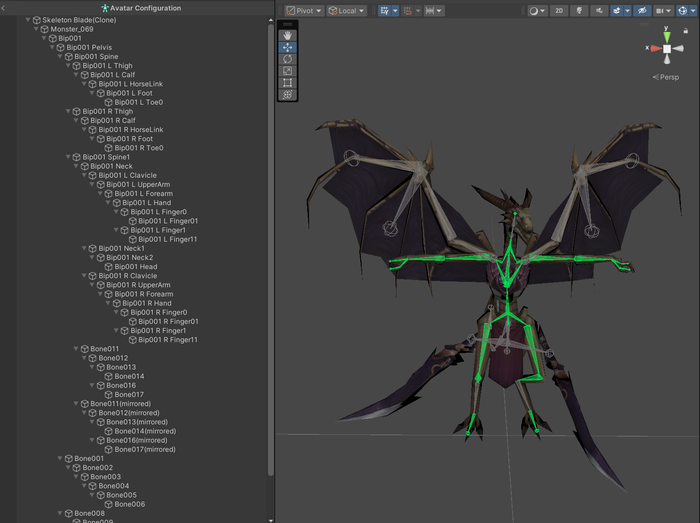

这个是Unity为我们映射的骨骼：

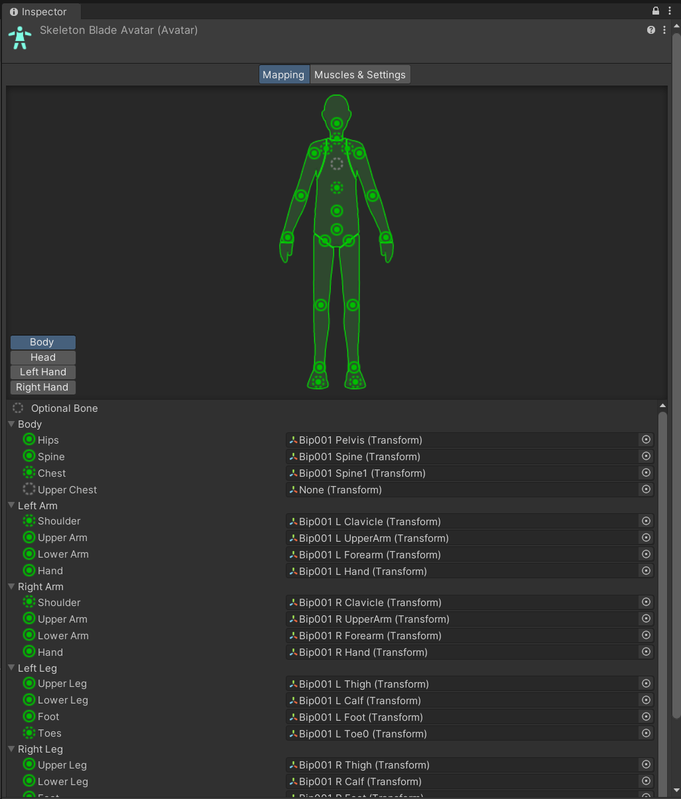

我们需要做的就是：

- 看这些骨骼是不是一一对应的

    在系统的映射骨骼中：实心表示关键位置的骨骼，必须对应。虚线表示可选骨骼，不对应也可以。灰色表示没有对应的骨骼。

    如果都是绿色的就表示没有问题，有问题是红色的。

- 看人物是否以T姿势站立

    我们在建模的时候人物会有一个默认的站立姿势。
    
    选择Pose：

    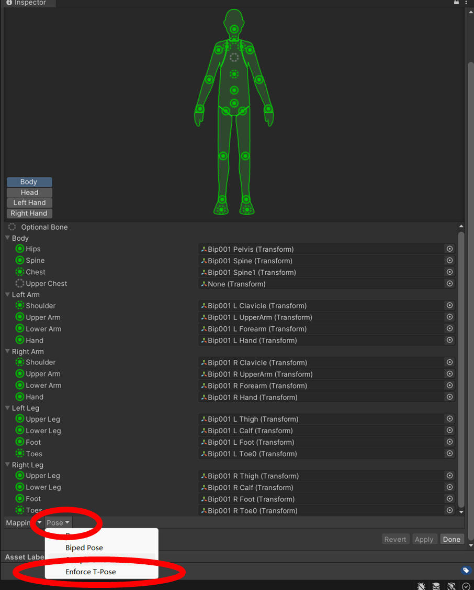

  1. 回到默认姿势
  2. 普通姿势
  3. T姿势

    我们需要选择T姿势。

有的时候，角色的骨骼发生一些小的偏差，系统不会判定错误，但是我们在动画中可以看到效果，比如把腿旋转小幅度，系统是不会判定错误的，但是我们肉眼可以看到细微的差别，这样就需要我们自己去调节一下。确保无误以后，我们就可以Apply保存。

## 二、动画状态机

每一个动画片段在Mecanim系统中叫做一个状态，状态机就是管理一组状态的播放顺序，切换等。

一个角色应该在任何给定的时刻执行某些特定的动作。这些动作是否可用是基于游戏进程的，但是典型的动作包括等待，移动，跑动，跳跃等。这些动作被称为状态。

在场景中当角色正在行走、等待或者做其他什么的时候都会处于某一个状态。一般来说，角色在进入下一个状态时会被限制，而不是可以从任意一个状态跳转至另一个任意状态。比如，一个“跑动跳跃”动作只可以在角色正在跑动时执行而不是当角色正在站立的时候。你永远不应该从等待动作中直接跳转到跑动跳跃动作状态。让角色从正确跳转状态的选项被称为状态转移。而将上面这些（**状态的集合，状态转移的集合和一些用于记录正确状态的变量**）整合起来的东西就是一个状态机。

状态和状态转移可以使用图形界面描述，在这个界面里，节点用来描述状态而带箭头的线段用来描述状态转移。你可以认为当前的状态（被标记或高亮的某个节点）只可以沿着这些箭头方向转移至其他状态。

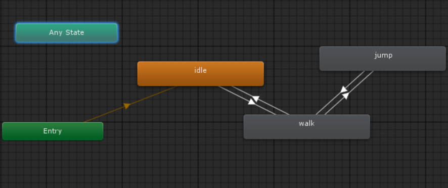

状态机包括状态、状态转移和事件，并且在大的状态机中可以设置一个小的子状态机。

- [Animation States](https://docs.unity3d.com/cn/2022.3/Manual/class-State.html) 动画状态
- [Animation Transitions](https://docs.unity3d.com/cn/2022.3/Manual/class-Transition.html) 动画转移
- [Animation Parameters](https://docs.unity3d.com/cn/current/Manual/AnimationParameters.html) 动画参数

### Animator组件

Animator组件负责把动画分配给GameObject，Animator包含以下两个关键元素：

1. Animator Controller
1. Avatar （仅当GameObject是人形角色时，才定义Avatar）

下图示意：一个游戏对象的Animator组件如何把Animation Clips、Animator Controller和Avatar资源组合在一起。

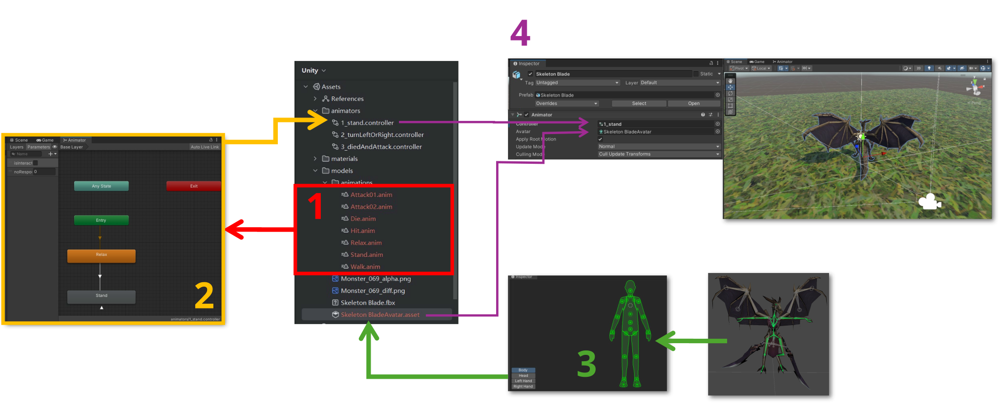

#### Properties 属性

- Controller 控制器：附加到角色的动画控制器；
- Avatar：角色的Avatar；
- Apply Root Motion 应用根动作：从动画自身来控制角色位置还是通过脚本控制；
- Animate Physics 动画物理：动画是否涉及物理？
- Culling Mode 动画物理：动画的消隐模式；
- Always animate 总是动画：总是动画，不进行消隐；
- Based on Renderers 基于渲染器：当渲染器不可见的时候，只有根动作是动画的。在角色不可见的同时，其他身体部分将保持静止。

### 动画控制器 Animator Controller

从项目视图可以创建一个动画控制器(菜单: Create > Animator Controller)。这会在磁盘上创建一个`.controller`资源，双击可以打开动画控制器编辑窗口，对动画状态进行编辑。

#### Animator（动画编辑器）

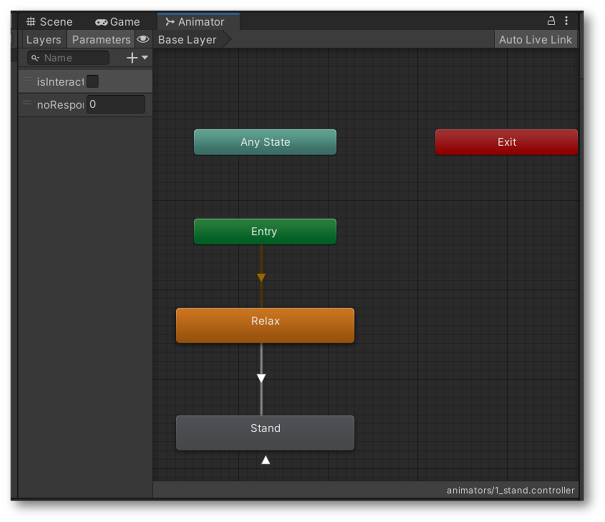

参数介绍：

- Layers：动画层；
- Parameters:动画控制变量，是动画片段触发的条件。

    动画控制变量的值可以在脚本中修改：

    ```csharp
    void SetFloat(string name, float value, float dampTime, float deltaTime);
    ```

    | 形参 | 说明     |
    |:-----|:--------|
    |name  |该参数的名称。|
    |value |该参数的新值。|
    |dampTime |允许参数达到该值的时间。|
    |deltaTime |当前帧的deltaTime。|

    ```csharp
    void SetFloat(string name, float value);
    ```
    | 形参 | 说明     |
    |:-----|:--------|
    |name  |该参数的名称。|
    |value |该参数的新值。|

- Any State:可在任意动画状态下转入连接Any State的动画。
    
    因为Any State在任意状态下都可以转入，所以条件应设为一次性触发。
    
- Exit:动画出口，该出口指向Entry。
- Entry:动画入口，连接该动画层的默认动画。
- Animator 编辑器中动画片段的参数属性：
  - Motion：表示当前状态对应的Animation Clip；
  - Speed：**表示当前状态的速度，1表示正常速度**，后面的Parameter勾上表示使用一个参数来表示当前的速度，同时输入框会变为下拉选择框，我们可以选择指定的参数，参数可以在Parameters面板中配置，其作用就是可以方便的通过代码修改参数的值来达到控制速度的目的，下面的Parameter也一致。
  - Mirror：是否将动画沿Y轴进行翻转，一般用来复用动画，比如右手的动画勾选了此项就会变为左手；
  - Cycle Offset：播放偏移量；
  - Foot IK：是否开启脚部的IK动画（反向动力学），一般关闭，在需要脚部贴合地面的情况时可以开启；
  - Write Defaults：动画播放完毕后是否将状态重置为默认状态，一般勾选即可；
  - Solo：勾选表示当前过渡为唯一过渡，即当前状态只能过渡到这个项目指向的状态；
  - Mute：勾选表示使这个动画过渡关闭，即当前状态不能过渡到这个项目指向的状态；
  - Add Behaviour ：在 Animator 中选中动画事件，可以在“Add Behaviour”中添加脚本增加动画的灵活性。脚本自动继承 “StateMachineBehaviour”。

    可以使用回调函数：`OnStateEnter();` `OnStateUpdate();` `OnStateMove();` `OnStateIK();`

> **案例：**
>
> 使用Animator Controller制作自动播放的动画
>
> 步骤：
>
> 1. 为模型建立Avadar；
> 1. 为模型添加Animator Controller（Asset面板右键 > Create > Animator Controller）；
> 1. 打开Animator Controller，将Idle动画拖入。

> **案例：**
>
> 动画的转移，添加程序控制动画的转移，例如，主角静止时播放Idle动画，当按下按键，人物来回跑动，松开停止
>
> 步骤：
>
> 1. 打开Animator Controller，将Run动画拖入；
> 1. 在Idle与Run之间添加动画转移（在动画片段图标上右键 > Make Transition）；
> 1. 添加控制变量；
>
>     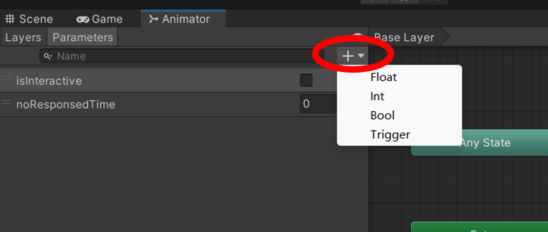
>
> 1. 双击状态转移的白色箭头，进行状态转移的设置；
>
>     去掉Has Exit Time的对勾，表示转移不是依赖固定时间。
>     在转移条件conditions中设置转移变量和发生这种转移时转移变量的值。
>
> 1. 添加脚本文件，在Update方法中添加如下代码：
>
>     ```csharp
>     void Update () 
>     { 
>         if (Input.GetButton ("Vertical")) 
>         { 
>             animator.SetBool ("run", true); 
>         } 
>         
>         if (Input.GetButtonUp ("Vertical")) 
>             animator.SetBool ("run",false); 
>     }
>     ```
>
>     上面的animator是获取的角色模型的animator组件。
>
> 1. 到此为止，动画存在的问题是按向下箭头和s键角色会超前走，下面将通过游戏播放速度的控制实现角色的后退动画；
>
>     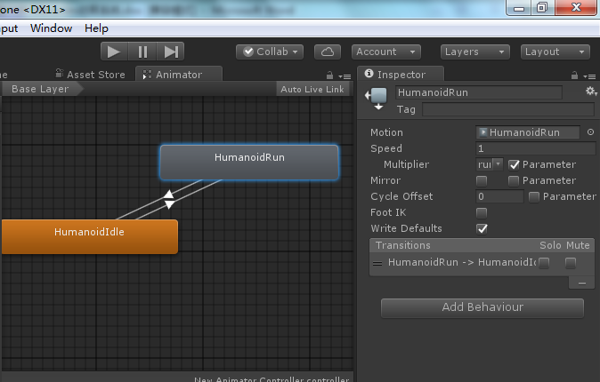
>
> 1. 动画的片段里的Speed属性控制动画的播放速度，此值越大，播放速度越快，要实现“后退”其实是动画的倒序播放，将Speed值设置为-1可实现。添加Speed的控制变量runspeed,并在脚本中进行控制：
>
>     ```csharp
>     void Update () 
>     { 
>         if (Input.GetButton ("Vertical")) 
>         { 
>             animator.SetBool ("run", true); 
>             animator.SetFloat ("runspeed", Input.GetAxisRaw ("Vertical"));
>         } 
>         
>         if (Input.GetButtonUp ("Vertical")) 
>             animator.SetBool ("run",false);         
>     }
>     ```

### 动画融合树 Blend Tree

> **案例：**
> 
> 动画的混合与控制：添加blendthree实现左转弯，右转弯。
>
> 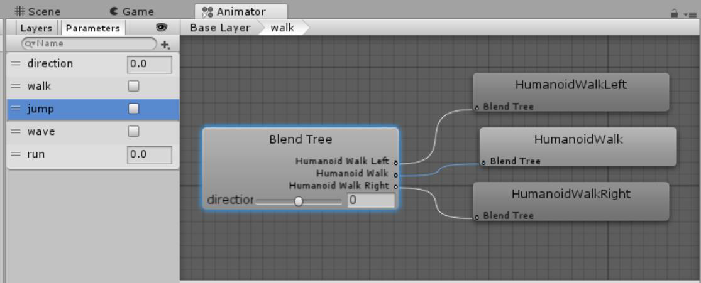
>
> 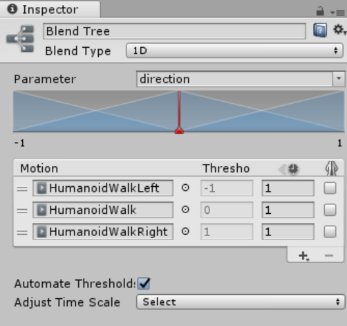
>
> 步骤：
>
> 1. 将现有的一个state转换成BlendTree，或者新建一个BlendTree；
> 1. 设置要融合的动画，设置比例值；
> 1. 设置控制融合比例的paranater。如上图direction
> 1. 在脚本中控制parameter
>
>   ```csharp
>   float h = Input.GetAxis("Horizontal"); 
>   anim.SetFloat("direction",h,0.25f,Time.deltaTime);
>   ```

## 三、动画遮罩

决定动画影响哪些骨骼

1. 添加Avatar Mask。设置遮罩。

    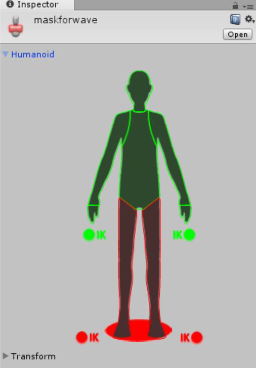

1. 添加第二个层（在Animator Controller里）。设置此遮罩，weight设置为1。

    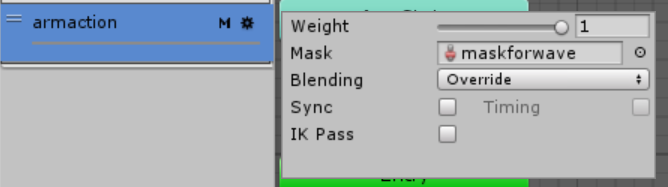

1. 在第二个层里添加动画。注意需要有一个空闲状态。

    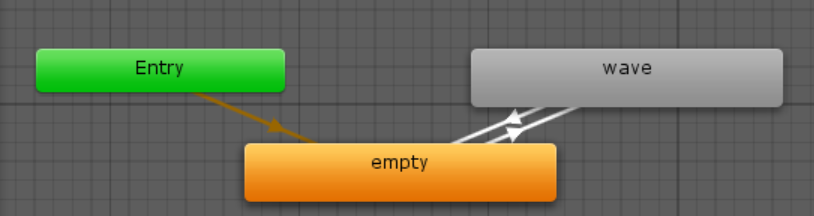

1. 添加paramter控制转移。

```csharp
if (Input.GetKey (KeyCode.Space)) 
    player.SetBool ("wave", true); 

if (Input.GetKeyUp (KeyCode.Space)) 
    player.SetBool ("wave", false);
```

## 四、反向动力学IK

反向动力学IK（Inverse kinematics）可以依据某些子关节的最终位置、角度来反推节点链上其他节点的合理位置，简单说就是子骨骼带动父骨骼进行运动。Unity中设置了Avatar的人形角色支持IK功能。

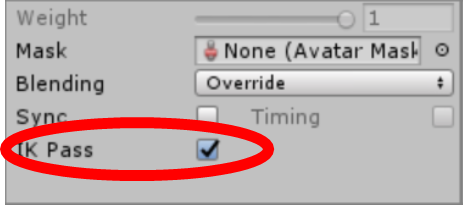

涉及的相关API：

```csharp
Animator.SetLookAtWeigh(float weight);
Animator.SetLookAtPosition(Vector3 lookAtPosition);
Animator.SetIKPosition(AvatarIKGoal goal, Vector3 goalPosition);
Animator.SetIKPositionWeight(AvatarIKGoal goal, float value);
```

> **举例：**

```csharp
void OnAnimatorIK()
{ 
    ani.SetIKPositionWeight (AvatarIKGoal.RightHand, 1.0f); 
    
    //设置某个骨骼的位置
    ani.SetIKPosition (AvatarIKGoal.RightHand, obj.transform.position);

    ani.SetIKRotationWeight (AvatarIKGoal.RightHand, 1.0f); 
    
    //设置某个骨骼的旋转位置    
    ani.SetIKRotation (AvatarIKGoal.RightHand, obj.transform.rotation);

    ani.SetLookAtWeight (1); 
    
    //头部看向的位置
    ani.SetLookAtPosition (obj.transform.position); 
}
```
