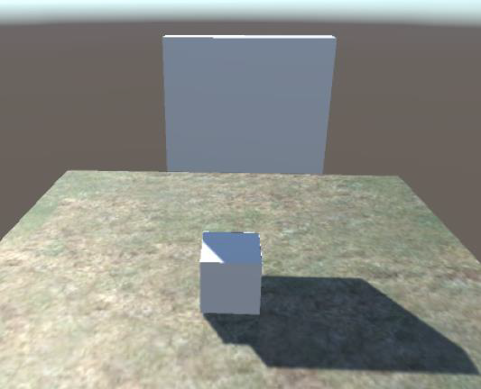

# 第六讲 物理引擎

## 课程目的

- 掌握`RigidBody`刚体组件的使用
- 重点掌握碰撞检测的使用
- 掌握粒子系统的使用


Unity内置了NVIDIA的Physx物理引擎，Physx是目前使用最为广泛的物理引擎，被很多游戏大作所采用，开发者可以通过物理引擎高效、逼真地模拟刚体碰撞、车辆驾驶、布料、重力等物理效果，使游戏画面更加真实而生动。

## 一、刚体组件`Rigidbody`

刚体能让游戏对象被物理引擎所控制，它能通过受到推力和扭力来实现真实的物理表现效果。所有游戏对象必须包含刚体组件来实现重力、通过脚本施加力、或者与其他对象进行交互。

### 属性

- `Mass` 质量，单位为kg，建议不要让对象之间的质量差达到100倍以上；
- `Drag` 空气阻力，为0表示没有阻力，infinity表示立即停止移动；
- `Angular Drag` 扭力的阻力，数值意义同上；
- `Use Gravity` 是否受重力影响；
- `Is Kinematic` 是否为Kinematic刚体，如果启用该参数，则对象不会被物理所控制，只能通过直接设置位置、旋转和缩放来操作它；
- `Interpolate` 如果你的刚体运动时有抖动，尝试一下修改这个参数，`None`表示没有插值，`Interpolate`表示根据上一桢的位置来做平滑插值，`Extrapolate`表示根据预测的下一桢的位置来做平滑插值；
- `Freeze Rotation` 如果选中了该选项，那么刚体将不会因为外力或者扭力而发生旋转，你只能通过脚本的旋转函数来进行操作；
- `Collision Detection` 碰撞检测算法，用于防止刚体因快速移动而穿过其他对象；
- `Constraints` 刚体运动的约束，包括位置约束和旋转约束，勾选表示在该坐标上不允许进行此类操作。

### `Rigidbody`变量

- `var velocity : Vector3` 刚体的速度向量；
- `var freezeRotation : bool` 控制物理是否改变物体的旋转；

    如果`freezeRotation`被启用，旋转不会被物体模拟修改。这对于创建第一人称射击游戏时是很有用的，因为玩家需要使用鼠标完全控制旋转。

    ```csharp
    rigidbody.freezeRotation = true; //冻结旋转
    ```

- `var useGravity : bool` 控制重力是否影响整个刚体，如果设置为`false`，刚体将不受重力影响。

## Rigidbody方法

### `Rigidbody.Addforce()`

```csharp
function AddForce (force : Vector3, mode : ForceMode = ForceMode.Force) : void
function AddForce (x : float, y : float, z : float, mode : ForceMode = ForceMode.Force) : void
```

添加一个力到刚体。

参数`force`是施加的力的矢量，参数`mode`是一个枚举类型的参数，用于指定力的模式。模式有：

- `ForceMode.Force`：施加一个持续的力，受质量`mass`影响。
- `ForceMode.Impulse`：施加一个瞬间的冲击力，受质量`mass`影响。
- `ForceMode.Acceleration`：施加一个持续的加速度，质量`mass`无影响。
- `ForceMode.VelocityChange`：施加一个改变刚体速度的力，质量`mass`无影响。

> **案例：**
>
> ```csharp
> //在全局坐标系统添加一个向上的力
> rigidbody.AddForce (Vector3.up * 10);
> rigidbody.AddForce (0, 10, 0);
> ```

### Rigidbody.AddTorque()

添加力矩。

```csharp
function AddTorque (torque : Vector3, mode : ForceMode = ForceMode.Force) : void
function AddTorque (x : float, y : float, z : float, mode : ForceMode = ForceMode.Force) : void
```

> **案例：**
>
> ```csharp
> rigidbody.AddTorque (Vector3.up * 10);
> rigidbody.AddTorque (0, 10, 0);
> ```

### Rigidbody.MovePosition()

移动位置。

```csharp
function MovePosition (position : Vector3) : void
```

> **案例：**
>
> ```csharp
> rigidbody.MovePosition(rigidbody.position + speed * Time.deltaTime);
> ```

### Rigidbody.Sleep()

刚体休眠。

当刚体空闲时，如一个掉到地板上的盒子，他们就会开始休眠。休眠是性能优化的一个策略，即物理引擎不会处理那些处于休眠中的刚体。这样一来，只要某刚体在正常情况下不移动，那么你可以在你的场景中添加大量的该刚体。

刚体休眠完全自动发生。只要刚体的`sleepThreshold`低于设定的值，该刚体就会开始休眠。其空闲一些帧后，就会被设置成休眠状态。处于休眠状态中的物体，不会再对其进行碰撞检测和模拟。这会节约大量的CPU开销。

刚体在以下情况中会被自动唤醒：

- 其他的刚体碰撞器作用于休眠的刚体
- 被其他的刚体通过移动的关节连接
- 修改了刚体的属性
- 当添加外力时
  
所以如果你想使游戏物体休眠，那么在他们将要进入休眠模式时不要更改他们的属性或者添加任何外力。 我们可以通过`rigidbody.Sleep`强制使刚体睡眠。

### Rigidbody.Wakeup()

刚体唤醒。

## 二、物理材质

物理材质用于调整摩擦力和碰撞单位之间的反弹效果。创建物理材质的方式是选择菜单栏的Assets > Create > Physic Material，然后从项目视图拖拽物理材质到场景的一个碰撞器上。

### 属性

- `Dynamic Friction` 动态摩擦力

    滑动摩擦力。当物体移动时的摩擦力。通常为0到1之间的值。值为0的效果像冰，而设为1时，物体运动将很快停止，除非有很大的外力或重力来推动它。

  - `Static Friction` 静态摩擦力

    静摩擦力。当物体在表面静止的摩擦力。通常为0到1之间的值。当值为0时，效果像冰，当值为1时，使物体移动十分困难。

- `Bouncyness` 弹力

    表面的弹力。值为0时不发生反弹。值为1时反弹不损耗任何能量。

- `Friction Combine Mode` 摩擦力组合方式

    定义两个碰撞物体的摩擦力如何相互作用。

- `Average` 平均

    使用两个摩擦力的均值。

- `Min` 最小值

    最小值。使用两个值中最小的一个。

- `Max` 最大值

    最大值，使用两个值中最大的一个。

- `Multiply` 相乘

    相乘。使用两个摩擦力的乘积。

- `Bounce Combine` 反弹组合

    定义两个相互碰撞的物体的相互反弹模式，它的模式种类和相互摩擦力模式一样。

## 三、碰撞器与碰撞检测

碰撞检测是游戏开发中非常重要的一部分。它可以用于检测游戏对象之间的交互，如角色与环境的碰撞、子弹与敌人的碰撞等。

两个物体检测到碰撞的必要条件：两个物体都要带有Colider（碰撞器），其中至少有一个物体带有RigidBody组件。

### 碰撞器

从菜单 Component > Physics 添加碰撞器：

- 盒碰撞器：原始立方体形状
- 球体碰撞器：原始球体形状
- 胶囊碰撞器：原始胶囊形状
- 网格碰撞器：从物体网格创建一个碰撞器，不能与另一个网格碰撞器碰撞
- 车轮碰撞器：专门轿车或其他行驶车辆
- 地形碰撞器

参数：

- `Is Trigger`是否为触发器：这个选项是供脚本使用的，如果勾选了这个则不会有碰撞的物理效果，但是游戏引擎会通知脚本有物体发生了碰撞。
- `Material`碰撞器材质：在这里可以选择一种物理材质，来模拟更真实的碰撞效果，比如金属之间的碰撞与石头之间的碰撞效果肯定是不一样的。
- `Center`碰撞器中心点：可以调整碰撞器离物体中心的距离，也就是移动绿框。
- `Size`碰撞器大小：调整碰撞器的缩放大小，调整XYZ可以让碰撞器变成任意大小的长方体。

### 碰撞检测与`Collision`类

碰撞（Collision）信息是传递到[Collider.OnCollisionEnter](https://docs.unity3d.com/2022.3/Documentation/ScriptReference/Collider.OnCollisionEnter.html)，[Collider.OnCollisionStay](https://docs.unity3d.com/2022.3/Documentation/ScriptReference/Collider.OnCollisionStay.html)和[Collider.OnCollisionExit](https://docs.unity3d.com/2022.3/Documentation/ScriptReference/Collider.OnCollisionExit.html)事件。

Variables变量：

- [relativeVelocity](https://docs.unity3d.com/2022.3/Documentation/ScriptReference/Collision-relativeVelocity.html)：两个碰撞物体的相对线性速度（只读）。
- [rigidbody](https://docs.unity3d.com/2022.3/Documentation/ScriptReference/Collision-rigidbody.html)：我们碰撞的刚体（只读）。如果我们碰撞的物体是一个没有附加刚体的碰撞器，返回`null`。
- [collider](https://docs.unity3d.com/2022.3/Documentation/ScriptReference/Collision-collider.html)：我们碰撞的碰撞器（只读）。
- [transform](https://docs.unity3d.com/2022.3/Documentation/ScriptReference/Collision-transform.html)：我们碰撞的物体的`Transform`（只读）。
- [gameObject](https://docs.unity3d.com/2022.3/Documentation/ScriptReference/Collision-gameObject.html)：`gameObject`是我们碰撞的物体（只读）。
- [contacts](https://docs.unity3d.com/2022.3/Documentation/ScriptReference/Collision-contacts.html)：接触点由物理引擎产生。

### 触发器

触发器是一种特殊的碰撞体，它不会产生物理碰撞反应，而是在物体之间发生碰撞时触发相应的事件。触发器可以用于检测物体之间的接触、进入或离开某个区域等情况。两个碰撞的物体有一个设置了 `isTrigger = true` 就会进入触发器。

Unity3D提供了其他几个与触发器相关的事件方法，包括`OnTriggerEnter`、`OnTriggerExit`、`OnTriggerStay`。

如果既要检测到物体的接触又不想让碰撞检测影响物体移动或要检测一个物件是否经过空间中的某个区域这时就可以用到触发器。

- 碰撞器：汽车被撞飞、皮球掉在地上又弹起效果
- 触发器：人站在靠近门的位置门自动打开效果

> **举例：**
>
> 人走到门前，门自动打开
>
> 
>
> ```csharp
> private Vector3 doorPos; 
> 
> // Use this for initialization 
> void Start () 
> { 
>     doorPos = GameObject.Find ("door").transform.position; 
> } 
> 
> // Update is called once per frame 
> void Update () 
> { 
>     transform.Translate (Vector3.back * Input.GetAxisRaw ("Vertical")*Time.deltaTime); 
>     transform.Rotate(Vector3.up*Input.GetAxisRaw("Horizontal")*Time.deltaTime*30.0f); 
> }
> 
> void OnTriggerStay(Collider info)
> { 
>     if (info.gameObject.name == "door") 
>     { 
>         if (info.gameObject.transform.position.y < 3f)
>             info.gameObject.transform.Translate (0.0f, 0.1f, 0.0f); 
>     } 
> }
> 
> void OnTriggerExit(Collider info)
> { 
>     GameObject.Find ("door").transform.position = doorPos; 
> }
> ```

### 碰撞过滤

设置层与层之间不发生碰撞，通过Edit > Project Setting > physics进行设置，可以让特定的层之间的物体不检测碰撞效果。

## 四、射线

射线是3D世界中一个点向一个方向发射的一条无终点的线，在发射轨迹中与其他物体发生碰撞时，它将停止发射。

用途：射线应用范围比较广，多用于碰撞检测（如：子弹飞行是否击中目标）。

我们要想在游戏中发射一条射线，必须要有两个元素，一个起始点，一个方向：

- `Ray.origin`：射线起点
- `Ray.direction`:射线的方向

创建一条射线的方法

```csharp
Ray (origin : Vector3, direction : Vector3)
```

`Origin`是射线的起点，`direction`是射线的方向。

> **案例：**
>
> ```csharp
> //定义一条射线，起点为Vector3.zero终点为物体坐标
> Ray ray=new Ray(Vector3.zero,transform.position);
> ```

相关API：

```csharp
Ray Camera.main.ScreenPointToRay(Vector3 pos)
```
返回一条射线Ray从摄像机到屏幕指定一个点。

### `Physics.Raycast` 光线投射

当光线投射与任何碰撞器交叉时为真，否则为假。

```csharp
static function Raycast (origin : Vector3, direction : Vector3, 
                         distance : float = Mathf.Infinity, 
                         layerMask : int = kDefaultRaycastLayers) : bool

static function Raycast (ray : Ray, 
                         distance : float = Mathf.Infinity,
                         layerMask : int = kDefaultRaycastLayers) : bool
```

Parameters参数

- `Origin` 在世界坐标，射线的起始点。
- `direction` 射线的方向。
- `Distance` 射线的长度。
- `layerMask` 只选定`Layermask`层内的碰撞器，其它层内碰撞器忽略。

```csharp
static function Raycast (origin : Vector3, 
                         direction : Vector3, out hitInfo : RaycastHit, 
                         distance : float = Mathf.Infinity, 
                         layerMask : int = kDefaultRaycastLayers) : bool

static function Raycast (ray : Ray, 
                         out hitInfo : RaycastHit, 
                         distance : float = Mathf.Infinity, 
                         layerMask : int = kDefaultRaycastLayers) : bool
```

Parameters参数

- `Origin` 在世界坐标，射线的起始点。
- `Direction` 射线的方向。
- `distance` 射线的长度。
- **`hitInfo` 如果返回`true`，`hitInfo`将包含碰到器碰撞的更多信息。**
- `layerMask` 只选定`Layermask`层内的碰撞器，其它层内碰撞器忽略。

### `RaycastHit` 光线投射碰撞

Variables变量

- [point](https://docs.unity3d.com/2022.3/Documentation/ScriptReference/RaycastHit-point.html) 在世界空间中，射线碰到碰撞器的碰撞点。
- [normal](https://docs.unity3d.com/2022.3/Documentation/ScriptReference/RaycastHit-normal.html) 射线所碰到的表面的法线。
- [barycentricCoordinate](https://docs.unity3d.com/2022.3/Documentation/ScriptReference/RaycastHit-barycentricCoordinate.html) 所碰到的三角形的重心坐标。
- [distance](https://docs.unity3d.com/2022.3/Documentation/ScriptReference/RaycastHit-distance.html) 从光线的原点到碰撞点的距离。
- [triangleIndex](https://docs.unity3d.com/2022.3/Documentation/ScriptReference/RaycastHit-triangleIndex.html) 碰到的三角形的索引。
- [textureCoord](https://docs.unity3d.com/2022.3/Documentation/ScriptReference/RaycastHit-textureCoord.html) 在碰撞点的UV纹理坐标。
- [textureCoord2](https://docs.unity3d.com/2022.3/Documentation/ScriptReference/RaycastHit-textureCoord2.html) 碰撞点的第二个UV纹理坐标。
- [lightmapCoord](https://docs.unity3d.com/2022.3/Documentation/ScriptReference/RaycastHit-lightmapCoord.html) 所在碰撞点的光照图UV坐标。
- [collider](https://docs.unity3d.com/2022.3/Documentation/ScriptReference/RaycastHit-collider.html) 碰到的碰撞器。
- [rigidbody](https://docs.unity3d.com/2022.3/Documentation/ScriptReference/RaycastHit-rigidbody.html) 碰到的碰撞器的Rigidbody。如果该碰撞器没有附加刚体那么它为`null`。
- [transform](https://docs.unity3d.com/2022.3/Documentation/ScriptReference/RaycastHit-transform.html) 碰到的刚体或碰撞器的变换。

> **举例：**
> 
> 向鼠标点击位置发射一颗子弹。
> 
> ```csharp
> if (Input.GetMouseButtonDown (0)) 
> { 
>     GameObject b = Instantiate (bullet); 
>     b.transform.position = GameObject.Find ("Main Camera").transform.position; 
>     Ray ray = Camera.main.ScreenPointToRay (Input.mousePosition); 
>     b.GetComponent<Rigidbody> ().AddForce (ray.direction * 10.0f,ForceMode.VelocityChange); 
> }
> ```

> **举例：**
>
> 拾取道具
>
> ```csharp
> void Update () 
> { 
>     if (Input.GetMouseButton (0)) 
>     { 
>         Ray ray = Camera.main.ScreenPointToRay (Input.mousePosition); 
>         RaycastHit hitinfo; 
>         
>         if (Physics.Raycast (ray, out hitinfo, 1000)) 
>         { 
>             if (hitinfo.collider.gameObject.tag == "box") 
>             { 
>                 Destroy (hitinfo.collider.gameObject); 
>                 Debug.Log ("捡到宝箱");
>             }
>         }
>     }
> }
> ```
