# 第七讲 Unity中的UI界面

## 课程目的

- 掌握UI 控件的使用
- 重点掌握UI 交互事件的处理
- 理解游戏开发中UI 界面的用途

Unity内置UGUI的UI界面系统。

在UGUI中，有一个UI的根节点Canvas，Canvas是画布，所有的UI组件就是绘制在这个画布里的，脱离画布，UI组件就不能用。

创建画布有两方式。一是通过菜单直接创建，二是直接创建一个UI 组件时，会在创建这个组件的同时自动创建一个容纳该组件的画布出来。

不管那种方式创建出画布时，系统都会自动创建出一个EventSystem组件，这是UI的事
件系统。

## 一、Canvas 画布

### Canvas 的渲染模式

在Canvas中有一Render Mode属性，它有3个选项，分别对应Canvas 的三种渲染模式：Screen Space – Overlay、Screen Space – Camera、World Space：

- **Screen Space – Overlay**：此模式不需要UI 摄像机，UI 将永远出现在所有摄像机的最前面（即在某个UI 的前面是不能再添加其他组件的），就好像是给摄像机贴上了一层膜。它的最大好处是不需要摄像机，不需要灯光。
- **Screen Space – Camera**：此模式需要提供一个UICamera，它支持在UI 前方显示3D 模型与粒子系统等内容。
不过此模式下，就需在中给它挂一个摄像机。

    当挂上摄像机并选择3D 显示模式时，我们选中这个摄像机，并移动它，可发现画布会跟随摄像机的移动而移动，且Game 视图显示的UI 其位置与大小均保持不变。

    这种模式，虽然UI 的显示效果与第一种模式没有什么两样，然而，因在画布与摄像机之间可放置三维物体或粒子系统，那么就可做出许多绚丽的特效。

- **World Space**：这个就是完全3D 的UI，也就是把UI 也当成3D 对象，如摄像机离UI 远了，其显示就
会变小，近了就会变大。

### Canvas Scaler画布的大小

我们把Canvas 中的Render Mode 设为Screen Space – Overlay 或Screen Space – Camera 时，此Canvas Scale 中的Ui Scale Mode（大小模式）就可用，且其中有3 个选项：

- Constan Pixel Size：固定像素尺寸
- Scale With Screen Size：屏幕自适应

    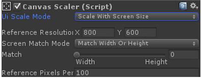

  - Reference Resolution：参考分辨率

    在不同分辨率下，控件显示的大小有所不同，这要根据实际情况综合考虑。

  - Screen Match Mode：屏幕匹配模式
  - Match Width Or Heigt：匹配宽度或高度

    此模式下会出现Match 调节滑杆，调节其控块位置，也会影响UI 元素显示的大小。

- Constant Physical Size：固定物理尺寸

## 二、Rect Transform

Unity 官方在推出UGUI 系统后，针对UI游戏物体，创建了一个新的基础组件：RectTransform，这个组件是基于Transform 组件的。

RectTransform 组件由两部分组成：

1. 组件基础部分：类似于Transform，控制游戏物体基本属性。
1. Anchors 锚点部分：UGUI 特有属性，用于实现UI 游戏物体锚点定位。

### RectTransform 基本属性

- 位置属性

    Pos X，Pos Y，Pos Z 三个属性等同于Transform 组件的Position；

    都是用于表示游戏物体在三维空间内的位置信息的。

- 旋转属性

    Rotation 属性等同于Transform 组件的Rotation；用于表示物体的旋转。

- 缩放属性

    Scale 属性等同于Transform 组件的Scale；用于表示物体的缩放比例。

- 宽高属性

    Width，Height 属性用于表示UI 游戏物体的宽和高。

### Anchor（锚点）

该功能主要实现相对布局的功能。

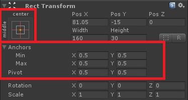

同时我们还可以非常直观的配置描点：

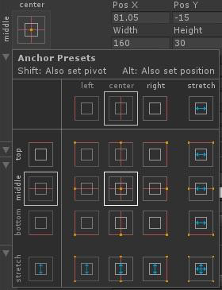

锚点描述的是当前UI的父对象的位置信息。

## 三、UI 元素

Unity 中的UI元素可以分为交互式控件和显示类控件，其中交互式控件用于处理玩家和游戏的交互，例如Button、Slider、ScrollBar等。显示类控件用于显示游戏信息，例如image、text 控件。

UI元素是以游戏对象的形式存在，如要在脚本中控制到UI 控件，需要在脚本最前面添加：

```csahrp
using UnityEngine.UI;
```

### Panel控件与Text控件

#### Panel 控件

Panel面板实际上就是一个容器，在其上可放置其他UI 控件，当移动面板时，放在其中的UI 组件就会跟随移动，这样我们可以更加合理与方便的移动与处理一组控件。也就是通过面板，我们可以把控件分组。一个功能完备的UI 界面，往往会使用
多个Panel 容器控件。而且一个面板里还可套用其他面板。当我们创建一个面板后，此面板会默认包含一个Image(Script)组件：

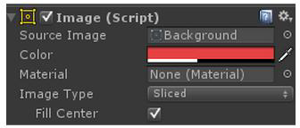

该组件中的Source Image 是设置面板的图像。Color，可改变面板的颜色。

#### Text 控件

Text 控件的相关属性：

- Character:（字符）
  - Font：字体
  - Font Style：字体样式
  - Font Size：字体大小
  - Line Spacing：行间距（多行）
  - Rich Text：“富”文本。例如：

    ```html
    U<b>G</b><i>U</i>I<color="yellow">学</color>习
    ```

    U<b>G</b><i>U</i>I<font color="yellow">学</font>习

  - Color：字体颜色
- Paragraph:（段落）

    设置文本在Text 框中的水平以及垂直方向上的对齐方式。

    水平方向上溢出时的处理方式。它有两种：Wrap 隐藏；Overflow 溢出；

    垂直方向上溢出时的处理方式。它有两种：Truncate 截断；Overflow 溢出。

### Image 控件

Image控件除了两个公共的组件Rect Transform与Canvas Renderer外，默认的情况下就只有一个Image(Script)组件：

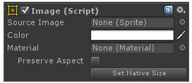

Source Image 是要显示的源图像，但如果我们把一个普通的图像往里拖放时，却不能成功放入，认真研究一下不难发现，放图像的框中，除了None表示还没有图像外，还有一个括号注释的Sprite，它的意思是精灵，可理解为它是贴图的一种特殊形式，它不具备其他功能，只给UI 做显示图片用，故我们给它取了一个特殊的名字：精灵Sprite，所以在Unity4.6中，要想把一个图片赋给Image，则需要把该图片转换成精灵格式，转换方法为，在Project中选中要转换在图片，然后在Inspector检视图中，单击Texture Type（纹理类型）右边的下拉框，在弹出的菜单中，选中选项Sprite(2D and UI)并点击下方的Apply（应用）按钮就可把此图片转换成精灵格式，随后就可拖放到Image 的Source Imag中了，如下图所示：

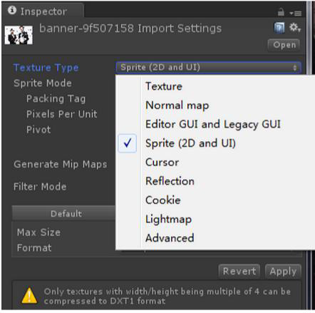

- Color：可改变图片的颜色；
- Material：材质，这是针对一些复杂的贴图使用。
- Image Type：贴图的类型，这是最重要的属性。

### Button 按钮

除了公共的Rect Transform 与Canvas Renderer 两个UI 组件外，Button 还默认拥有Image(Script)与Button(Script)两个组件。

组件Image(Script)里的属性与前面所讲的Image 控件的Image(Script)组件里的属性是一样的，例如Source Image 的图像类型仍为一个Sprite（精灵），通过为此赋值，就可改变此Button 的外观了，如果你为属性赋值了图片精灵，那么此Button 的外观就与此精灵一致了。Button 是一个复合控件，它中还包含一个Text 子控件：，通过此子控件可设置Button 上显示的文字的内容、字体、样式、字大小、颜色等，与前面所讲的Text 控件是一样的。

#### Button 组件里的属性

##### Interactable：是否启用（交互性）

如果你把其后的对勾去掉，此Button 在运行时将点不动，即失去交互性了。

##### Transition：过渡方式

它有四个选项，默认为Color Tint（颜色色彩）

- None：没有过渡方式。
- Color Tint：颜色过渡
  - Target Graphic：目标图像
  - Normal Color：正常颜色
  - Highlighted Color：经过高亮色
  - Pressed Color：点击色
  - Disabled Color：禁用色
  - Color Multiplier：颜色倍数
  - Fade Duration：变化过程时间
- Sprite Swap：精灵交换。

    需要使用相同功能不同状态的贴图。

  - Target Graphic：目标图像
  - Highlighted Sprite：鼠标经过时的贴图
  - Pressed Sprite：点击时的贴图
  - Disabled Sprite：禁用时的贴图
- Animation：动画

    其中的Normal Trigger、Highlighted Trigger、Pressed Trigger、Disabled Trigger 等属性是不能赋值的，它们是自动生成的。当单击“Auto Generate Animation”（自动生成动画）按钮时，系统会为你打开一个New Animation Contoller（新建动画控制器）窗口，给此动画取名（动画的名默认为该Button 的名字，当然其扩展名为controller），创建成功后，可看到刚才创建的动画文件（动画的名默认为该Button 的名字），且在这个Button 的Inspector 检视图中可看到会为此Button 增加一个Animator 组件。

    其实这个动画还没有，要做出这个动画，需先选中这个Button，然后点击系统菜单Window > Animation（注意不是Animator），就会打开一个Animation 动画编辑窗口。

    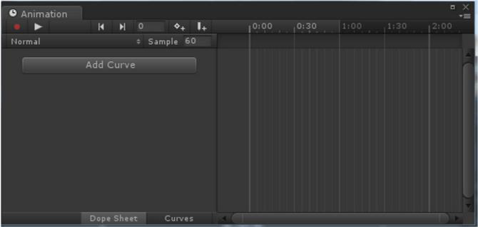

#### OnClick 事件

在Button组件的下方有一个`OnClick()`选项，这就是Button控件处理事件的重要机制。`OnClick()`意思为当该按钮被点击时所发生的事件，而此事件在UI 中是委托机制。

在Hierarchy视图的Canvas 中创建一个空对象，并假设命名为Event，并把上面的脚本作为组件挂到这个空对象上，那么这个对象是具有事件处理能力的object了。

为某个按钮添加其事件处理的委托对象我们在层级面板中选中要产生单击事件的按钮比如Button1，然后拖动其Inspector 面板右边的滚动条，使其Button(Script)组件下的`OnClick()`显现出来：

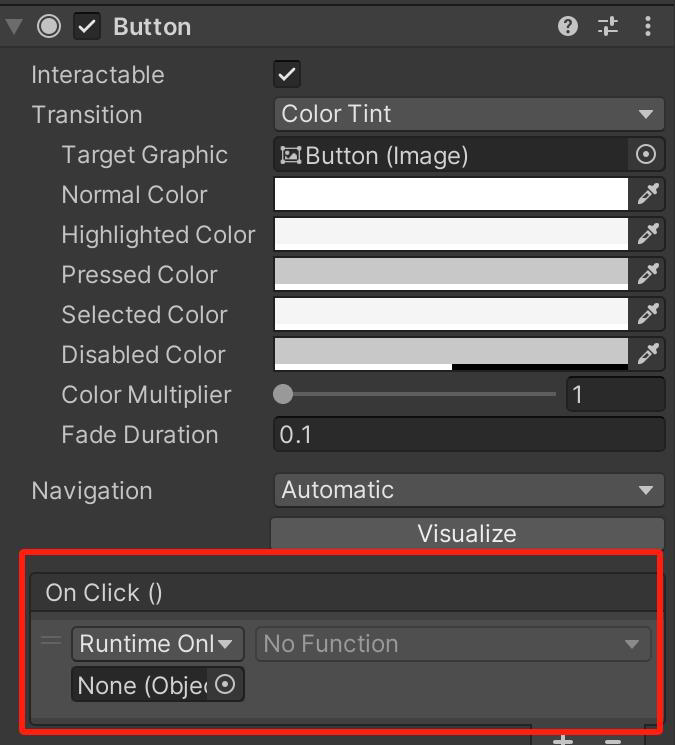

此时其事件列表为空：List is Empty，我们单击其下的“+”按钮为其添加一个事件。

### Toggle控件

在Unity中，Toggle组件是一种用于创建开关按钮的UI元素。它允许用户打开或关闭某个选项，类似于复选框。Toggle组件在游戏开发中非常常见，尤其是在设置菜单或选项界面中。

#### 创建Toggle组件

要在Unity 中创建一个Toggle 组件，可以按照以下步骤操作：

1. 在层次视图中右键点击，选择UI -> Toggle。
2. 这将创建一个新的Toggle 对象，并自动添加必要的组件，如Toggle 和Image。

#### Toggle组件的属性

Toggle 组件有几个重要的属性：

- IsOn：表示Toggle 的当前状态（开或关）。
- Graphic：用于显示Toggle 状态的图像。
- Group：表示Toggle 所属的组（如果有）。
- OnValueChanged：当Toggle 的值发生变化时触发的事件

> **举例：**
> 
> 难度选择对话框
>
> 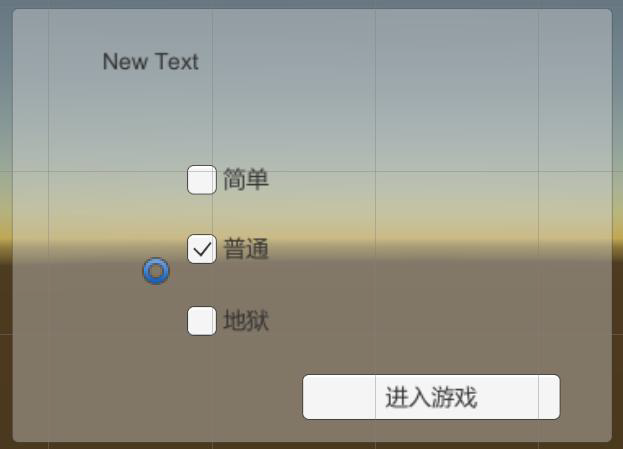
>

```csharp
void Update () 
{
    if (panel.activeSelf) 
    {
        if (hard.isOn)
            info_txt = "地狱";
        if (custom.isOn)
            info_txt = "普通";
        if (simple.isOn)
            info_txt = "简单";

        info.text = "您选择的难度是" + info_txt;
    }
}
```

### Slider控件

Slider（滑动条）是Unity UGUI 中的一种常用UI 组件, 用于在用户界面中实现滑动选择的功能。通过拖动滑块，用户可以选择一个数值范围的内值。

Slider 组件由两部分组成：滑动区域和滑块。滑动区域用于显示滑动条的背景，而滑块则表示当前的数值位置。用户可以通过拖动滑块来改变数值。

Slider 组件的常用属性：

- **Min Value（最小值）**：滑动的条的最小值。
- **Max Value 最（大）值**：滑动条的最大值。
- **Value（当前值）**：滑动条的当前值。
- **Direction（方向）**：滑动条的方向，可以是水平或垂直。
- **Handle Slide Area**：滑块可以在滑动区域内滑动。
- **Handle Slide Range（滑块滑动范围）**：滑块在动滑区域内滑动的范围。

### ScrollBar 控件

ScrollBar 允许用户通过拖动滑块来浏览超出视图范围的内容。例如，显示超长文本，物品栏的滚动显示等。

Scrollbar 组件包含以下几个关键属性：

- Handle Rect：滑块的矩形区域，用户可以拖动它来滚动内容。
- Direction：滚动条的方向，可以是垂直或水平。
- Value：表示滑块的当前位置，取值范围在0 到1 之间。
- Size：滑块的大小，表示滑块占滚动条总长度的比例。
- Number Of Steps：滚动条的不同滚动位置的数量，如果设置为0，则滚动条可以平滑滚动。

> **示例：**
> 
> 用滚动条控制文本区域的滚动显示。
>
> 步骤：
>
> 1. 添加一个Panel，并为其添加子物体Text和子物体ScrollBar。
>
>   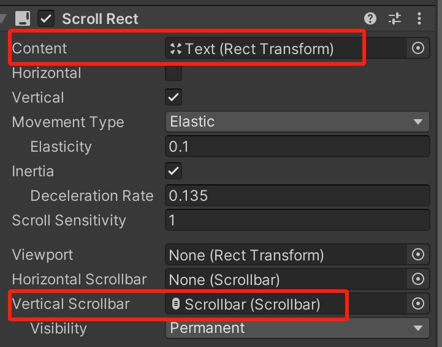
>
> 2. 为Panel添加ScorllRect组件，并设置其中的属性context 为Text，选择Vertical ScrollBar为Scrollbar。
> 3. 为Panel添加Mask组件。
>
> 最终效果如下：
> 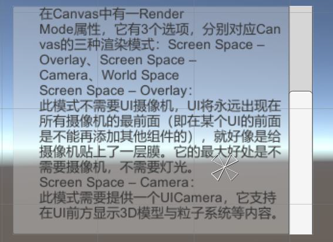
