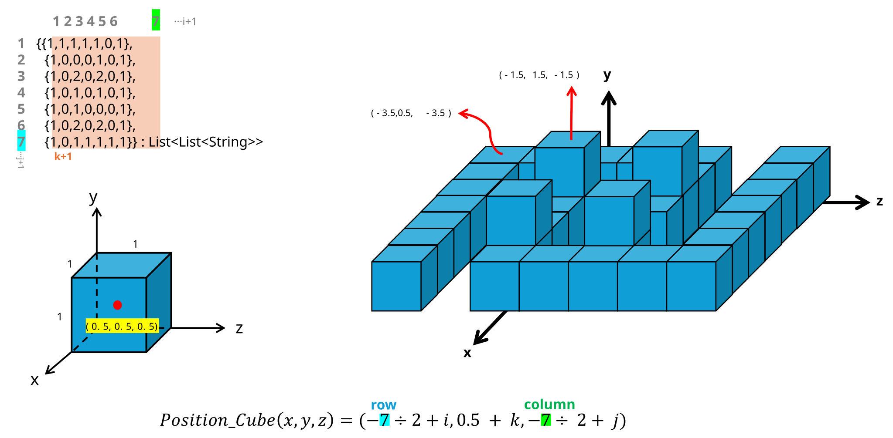
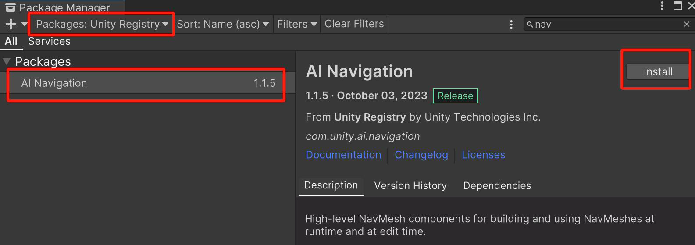
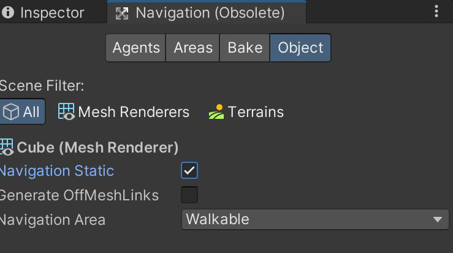
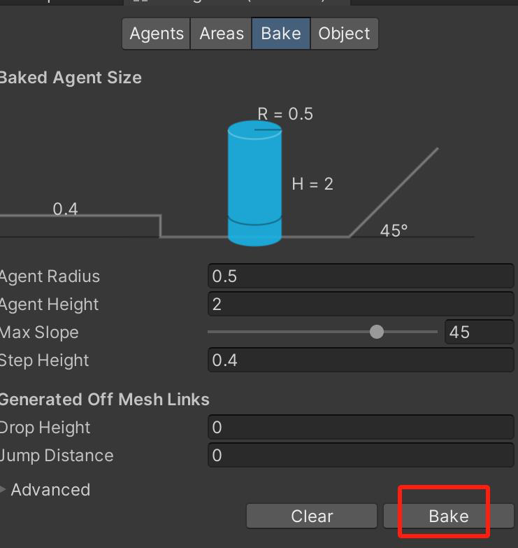
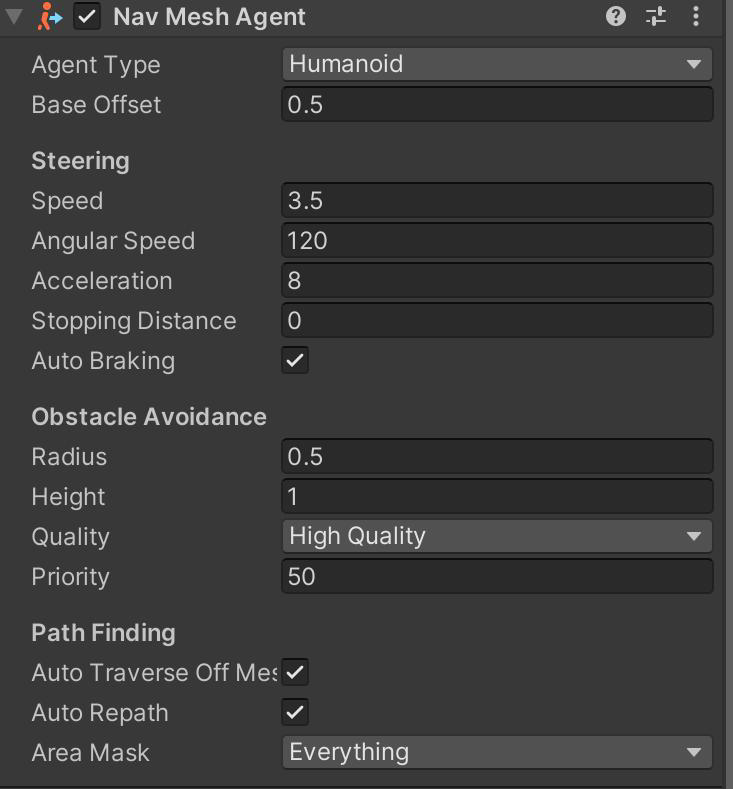
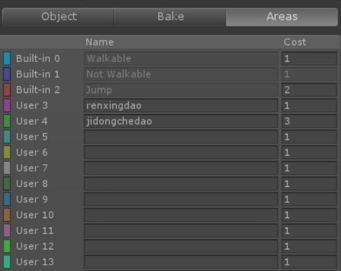
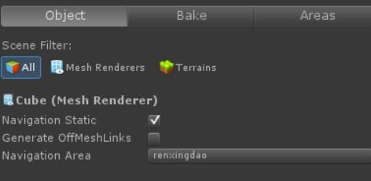

# 第八讲 Unity中的数据存储

## 课程目的

- 掌握PlayerPrefs类的使用
- 掌握TextAsset读取TXT文本的方法
- 掌握Json读取数据的方法

在游戏开发中，存储游戏数据是非常重要的，因为游戏数据决定了游戏的各个方面，例
如游戏的进度、玩家的成就、游戏的设置等等。

不同的方法有不同的特点和应用场景，在实际的游戏开发中，我们可以根据实际的需求
选择合适的数据存储方法。如果我们只存储一些简单的数据，可以选择PlayerPrefs；如果存
储一些复杂的数据，可以选择JSON或XML；如果需要存储大量的结构化数据，可以选择SQLite
数据库。

## 一、`PlayerPrefs`类

Unity3D 中提供了`PlayerPrefs`这个类，用来实现数据的储存与读取。
它的工作原理非常简单，以键值对的形式将数据保存在文件中，然后程序可以根据这个
名称取出上次保存的数值。`PlayerPrefs`主要适用于一些简单的游戏数据的存储，例如玩家
的音效、音乐、难度等级等。使用`PlayerPrefs`可以方便地在游戏中读写这些数据。
`PlayerPrefs`类支持3 中数据类型的保存和读取，浮点型、整形、和字符串型。

分别对应的函数为：

- `SetInt()`保存整型数据；
- `GetInt()`读取整形数据；
- `SetFloat()`保存浮点型数据；
- `GetFlost()`读取浮点型数据；
- `SetString()`保存字符串型数据；
- `GetString()`读取字符串型数据；

> **举例：**
>
> ```csharp
> PlayerPrefs.SetInt("keyInt",100);
> PlayerPrefs.SetFloat("keyFloat",100.02f);
> PlayerPrefs.SetString("keyString","hello");
> PlayerPrefs.GetInt("keyInt");
> PlayerPrefs.GetFloat("keyFloat");
> PlayerPrefs.GetString("keyString");
> 
> //删除PlayerPrefs 中某一个key 的值
> PlayerPrefs. DeleteKey (“key”);
> 
> //判断PlayerPrefs 中是否存在这个key
> bool b = PlayerPrefs.HasKey(“key”);
> ```

## 二、`TextAsset`文本资源类

在Unity 中，`TextAsset`是一种特殊的资源类型，用于处理文本文件。`TextAsset`的
一个常见用途是在游戏中管理大量文本,例如游戏中会处理大量的对白信息。它允许开发者
将文本文件作为资源导入Unity 项目，并在游戏运行时访问这些文件的内容。`TextAsset`不
仅支持文本格式，还可以用于存储二进制数据，通过将文件扩展名更改为.bytes 来实现。
Unity 中使用`TextAsset`，可以将支持的文本文件格式直接拖放到项目的资源文件夹中。支
持的格式包括`.txt`、`.html`、`.htm`、`.xml`、`.bytes`、`.json`、`.csv`、`.yaml`和`.fnt`。一旦文件被导入，它就会被转换为`TextAsset`对象。

我们一般会将文本文件放在Unity3d 的project > Asset 文件目录下，Unity3d 就会识别文件成为`TextAsset`。Unity script 的类`TextAsset` 来操作文本中的数据。

如果仅是打开记事本录入文本ASCII 保存，会发现文本中的中文汉字不能正常显示的，这是因为`TextAsset`只支持UTF-8 的缘故。可以将text 文本文件重新保存为UTF-8格式。

### `Resources.Load`加载资源

```csharp
TextAsset text = (TextAsset)Resources.Load("unity3d");
```

使用这种方式加载资源，首先需要下Asset 目录下创建一个名为Resources的文件夹，这个命名是U3D 规定的方式，然后把资源文件放进去。

> **案例：**
>
> 利用TextAsset 读入文件并生成地图。
>
> 先准备如下的地图文件：
>
> map.txt 地图文件：
>
> ```text
> 1,1,1,1,1,0,1
> 1,0,0,0,1,0,1
> 1,0,2,0,2,0,1
> 1,0,1,0,1,0,1
> 1,0,1,0,0,0,1
> 1,0,2,0,2,0,1
> 1,0,1,1,1,1,1
> ```
>
> 算法思想如下图：
>
>   
>
> 添加如下代码：
>
> ```csharp
> void Start()
> {
>     TextAsset textAsset = (TextAsset)Resources.Load("map"); //载入map.txt
>     string[] map_row_string = textAsset.text.Trim().Split('\n');    //清除这个Map.csv前前后后的换行，空格之类的，并按换行符分割每一行
>     int map_row_max_cells = 0;  //计算这个二维表中，最大列数，也就是在一行中最多有个单元格
> 
>     List<List<string>> map_Collections = new List<List<string>>();  //设置一个C#容器 map_Collections
> 
>     for (int i = 0; i < map_row_string.Length; i++) //读取每一行的数据
>     {
>         List<string> map_row = new List<string>(map_row_string[i].Split(','));  //按逗号分割每个一个单元格
>         
>         if (map_row_max_cells < map_row.Count)
>         {   //求一行中最多有个单元格，未来要据此生成一个Plane来放Cube的
>             map_row_max_cells = map_row.Count;
>         }
> 
>         map_Collections.Add(map_row);   //整理好，放到容器map_Collections中
>     }
> 
>     /*生成一个刚好放好Cube的Plane*/
>     GameObject map_plane = GameObject.CreatePrimitive(PrimitiveType.Plane); //生成一个Plane
>     map_plane.transform.position = new Vector3(0, 0, 0);    //放到(0,0,0)这个位置
> 
>     //求其原始大小
>     float map_plane_original_x_size = 
>         map_plane.GetComponent<MeshFilter>().mesh.bounds.size.x;
>     float map_plane_original_z_size =
>         map_plane.GetComponent<MeshFilter>().mesh.bounds.size.z;
> 
>     //缩放这个map到所需大小，刚好和二维表匹配
>     float map_plane_x = map_row_max_cells / map_plane_original_x_size;
>     float map_plane_z = map_Collections.Count / map_plane_original_z_size;
>     
>     map_plane.transform.localScale = new Vector3(map_plane_x, 1, map_plane_z);
> 
>     /*在Plane上放Cube*/
>     for (int i = 0; i < map_Collections.Count; i++) //Z方向是长度就是容器的大小，也就是map.txt有多少有效的行
>     {
>         for (int j = 0; j < map_Collections[i].Count; j++)
>         {   //X方向的宽度就是容器一行中的最大的长度，也就是map.txt中每行最大长度
>             int cube_num = int.Parse(map_Collections[i][j]);    //将每个单元格的数字转换成整型
>             
>             for (int k = 0; k < cube_num; k++)
>             {   //根据数字，在一个单元格内生成cube
> 
>                 GameObject cube = GameObject.CreatePrimitive(PrimitiveType.Cube);
>                 cube.transform.position = new Vector3(-(map_row_max_cells / 2) + i,
>                                                       (float)0.5 + k, 
>                                                       -(map_Collections.Count / 2) + j);
>                 /*
>                 cube所处的坐标就是(-(map_row_max_cells / 2) + i, (float)0.5 + k,
>                 -(map_Collections.Count / 2) + j)
>                 */
>             }
>         }
>     }
> }
> ```

## 三、使用JSON

JSON(JavaScript Object Notation) 是一种轻量级的数据交换格式。

### 序列化与反序列化

**序列化**是将对象转换为可传输或可存储的格式的过程。序列化可以将一个**对象转换为二进制数据流、XML文档或JSON字符串**等格式。

**反序列化**是将序列化的数据转换回对象的过程。反序列化可以将二进制数据流、XML 文档或JSON 字符串等格式的数据转换回原始的对象，以便在程序中继续使用这些数据。例如，在Unity 游戏中，可以从服务器或其他客户端接收JSON 格式的字符串，并将其反序列化为游戏数据对象。

Unity中使用`JsonUtility`类实现对象和字符串的转换。

```csharp
JsonUtility.ToJson(类对象)
JsonUtility.FromJson<类名>(字符串)
```

> **案例：**
>
> 有一个玩家类：
>
> ```csharp
> public class player {
>     public string name;
>     public int age;
> 
>     public player() { }
> 
>     public player(string _name, int _age) {
>         name = _name;
>         age = _age;
>     }
> }
> ```
>
> 有一个对象`player cat = new player ("cat", 19);`用JSON 表示就是：
>
> ```json
> {
>     "name": "cat",
>     "age": 19
> }
> ```

### 数据转换

使用`JsonReader`和`JsonWritter`对象实现类的实例与字符串之间的转换。

```csharp
player cat = new player ("cat", 19);
string cat_text = JsonUtility.ToJson(cat);
player catnew = JsonUtility.FromJson<player>(cat_text);
```

### 数据存储

使用`System.IO`下面的`File.WriteAllText()`和`File.ReadAllText()`函数实现文本数据的存储和读取。

例如：

```csharp
File.WriteAllText (Application.dataPath + "/" + "data.txt", cat_text);
tring catinfo = File.ReadAllText (Application.dataPath + "/" + "data.txt");
```

## 四、数据加密*

数据加密可以使保存的文本信息编程乱码，提高存储的安全性。Unity中已经提供了加密算法，使用加密算法需要引入下面的命名空间：

```csharp
using System.Security.Cryptography;
using System.Text;
using System;
```

加密要用到一个`RijndaelManaged`类，这个类的内容如下所示：

**属性：**

| 名称                                     | 说明        |
|:----------------------------------------|:------------|
| [BlockSize](https://learn.microsoft.com/en-us/dotnet/api/system.security.cryptography.rijndaelmanaged.blocksize?view=net-9.0#system-security-cryptography-rijndaelmanaged-blocksize)                               | 获取或设置加密操作的块大小（以位为单位）。 |
| [FeedbackSize](https://learn.microsoft.com/en-us/dotnet/api/system.security.cryptography.rijndaelmanaged.feedbacksize?view=net-9.0#system-security-cryptography-rijndaelmanaged-feedbacksize)                            | 获取或设置针对密码反馈 (CFB) 和输出反馈 (OFB) 密码模式的加密操作的反馈大小（以位为单位）。 |
| [IV](https://learn.microsoft.com/en-us/dotnet/api/system.security.cryptography.rijndaelmanaged.iv?view=net-9.0#system-security-cryptography-rijndaelmanaged-iv)                                      | 获取或设置用于对称算法的初始化向量 (IV)。 |
| [Key](https://learn.microsoft.com/en-us/dotnet/api/system.security.cryptography.rijndaelmanaged.key?view=net-9.0#system-security-cryptography-rijndaelmanaged-key)                                     | 获取或设置用于对称算法的密钥。 |
| [KeySize](https://learn.microsoft.com/en-us/dotnet/api/system.security.cryptography.rijndaelmanaged.keysize?view=net-9.0#system-security-cryptography-rijndaelmanaged-keysize)                                 | 获取或设置用于对称算法的密钥大小（以位为单位）。 |
| [LegalBlockSizes](https://learn.microsoft.com/en-us/dotnet/api/system.security.cryptography.symmetricalgorithm.legalblocksizes?view=net-9.0#system-security-cryptography-symmetricalgorithm-legalblocksizes)                         | 获取对称算法支持的块大小（以位为单位）。 |
| [LegalKeySizes](https://learn.microsoft.com/en-us/dotnet/api/system.security.cryptography.rijndaelmanaged.legalkeysizes?view=net-9.0#system-security-cryptography-rijndaelmanaged-legalkeysizes)                           | 获取对称算法支持的密钥大小（以位为单位）。 |
| [Mode](https://learn.microsoft.com/en-us/dotnet/api/system.security.cryptography.rijndaelmanaged.mode?view=net-9.0#system-security-cryptography-rijndaelmanaged-mode)                                    | 获取或设置对称算法的运算模式。 |
| [Padding](https://learn.microsoft.com/en-us/dotnet/api/system.security.cryptography.rijndaelmanaged.padding?view=net-9.0#system-security-cryptography-rijndaelmanaged-padding)                                 | 获取或设置对称算法中使用的填充模式。 |

**方法：**

| 名称                                     | 说明        |
|:----------------------------------------|:------------|
| [Clear()](https://learn.microsoft.com/en-us/dotnet/api/system.security.cryptography.symmetricalgorithm.clear?view=net-9.0#system-security-cryptography-symmetricalgorithm-clear)                                 | 释放 SymmetricAlgorithm 类使用的所有资源。 |
| [CreateDecryptor()](https://learn.microsoft.com/en-us/dotnet/api/system.security.cryptography.rijndaelmanaged.createdecryptor?view=net-9.0#system-security-cryptography-rijndaelmanaged-createdecryptor)                       | 用当前的 Key 属性和初始化向量 (IV) 创建对称解密器对象。 |
| [CreateDecryptor(Byte[], Byte[])](https://learn.microsoft.com/en-us/dotnet/api/system.security.cryptography.rijndaelmanaged.createencryptor?view=net-9.0#system-security-cryptography-rijndaelmanaged-createencryptor(system-byte()-system-byte()))         | 使用指定的 Rijndael 和初始化向量（Key）创建对称 IV 解密器对象。 |
| [CreateEncryptor()](https://learn.microsoft.com/en-us/dotnet/api/system.security.cryptography.rijndaelmanaged.createencryptor?view=net-9.0#system-security-cryptography-rijndaelmanaged-createencryptor)                       | 用当前的 Key 属性和初始化向量 (IV) 创建对称加密器对象。 |
| [CreateEncryptor(Byte[], Byte[])](https://learn.microsoft.com/en-us/dotnet/api/system.security.cryptography.rijndaelmanaged.createencryptor?view=net-9.0#system-security-cryptography-rijndaelmanaged-createencryptor(system-byte()-system-byte()))         | 使用指定的 Rijndael 和初始化向量（Key）创建对称 IV 加密器对象。 |
| [Dispose()](https://learn.microsoft.com/en-us/dotnet/api/system.security.cryptography.symmetricalgorithm.dispose?view=net-9.0#system-security-cryptography-symmetricalgorithm-dispose)                               | 释放 SymmetricAlgorithm 类的当前实例所使用的所有资源。 |
| [Equals(Object)](https://learn.microsoft.com/en-us/dotnet/api/system.object.equals?view=net-9.0#system-object-equals(system-object))                           | 确定指定对象是否等于当前对象。 |
| [GenerateIV()](https://learn.microsoft.com/en-us/dotnet/api/system.security.cryptography.rijndaelmanaged.generateiv?view=net-9.0#system-security-cryptography-rijndaelmanaged-generateiv)                             | 生成用于该算法的随机初始化向量（IV）。 |
| [GenerateKey()](https://learn.microsoft.com/en-us/dotnet/api/system.security.cryptography.rijndaelmanaged.generatekey?view=net-9.0#system-security-cryptography-rijndaelmanaged-generatekey)                            | 生成用于该算法的随机 Key。 |
| [GetHashCode()](https://learn.microsoft.com/en-us/dotnet/api/system.object.gethashcode?view=net-9.0#system-object-gethashcode)                            | 作为默认哈希函数。 |
| [GetType()](https://learn.microsoft.com/en-us/dotnet/api/system.object.gettype?view=net-9.0#system-object-gettype)                                | 获取当前实例的 Type。 |
| [ToString()](https://learn.microsoft.com/en-us/dotnet/api/system.object.tostring?view=net-9.0#system-object-tostring)                               | 返回表示当前对象的字符串。 |
| [ValidKeySize(Int32)](https://learn.microsoft.com/en-us/dotnet/api/system.security.cryptography.symmetricalgorithm.validkeysize?view=net-9.0#system-security-cryptography-symmetricalgorithm-validkeysize(system-int32))                       |确定指定的密钥大小对当前算法是否有效。|

加密的代码如下所示：

```csharp
//秘钥，32 位的字符串
static string key = "12345678901234567890123456789012";
//加密算法
private static string Encrypt(string toE)
{
    byte[] keyArray = UTF8Encoding.UTF8.GetBytes (key);
    RijndaelManaged rDel = new RijndaelManaged ();
    rDel.Key = keyArray;
    rDel.Mode = CipherMode.ECB;
    rDel.Padding = PaddingMode.PKCS7;
    ICryptoTransform cTransform = rDel.CreateEncryptor ();

    byte[] toEncrytArray = UTF8Encoding.UTF8.GetBytes (toE);
    byte[] resultArray = cTransform.TransformFinalBlock (toEncrytArray, 0, toEncrytArray.Length);
    return Convert.ToBase64String (resultArray, 0, resultArray.Length);
}

//解密算法
private static string Decrypt(string toD)
{
    byte[] keyArray = UTF8Encoding.UTF8.GetBytes (key);
    RijndaelManaged rDel = new RijndaelManaged ();
    rDel.Key = keyArray;
    rDel.Mode = CipherMode.ECB;
    rDel.Padding = PaddingMode.PKCS7;
    ICryptoTransform cTransform = rDel.CreateDecryptor ();
    byte[] toEncrytArray = Convert.FromBase64String (toD);
    byte[] resultArray = cTransform.TransformFinalBlock (toEncrytArray, 0, toEncrytArray.Length);
    return UTF8Encoding.UTF8.GetString (resultArray);
}
```

---

# 第九讲 Unity中的导航系统

## 课程目的

- 掌握NavMesh 的使用
- 理解导航网格层的作用
- 掌握分离网格链接的使用

NavMesh(导航网格)是3D 游戏世界中用于实现动态物体自动寻路的一种技术，将游戏中复杂的结构组织关系简化为带有一定信息的网格，在这些网格的基础上通过一系列的计算来实现自动寻路。导航时，只需要给导航物体挂载导航组建，导航物体便会自行根据目标点来寻找最直接的路线，并沿着该线路到达目标点。要使用Unity 中的导航网格，需要先导入对应的包，在window 中打开Package Manager,安装AI Navigation 包。



## 一、NavMesh 的使用

### Navigation static

窗口 > 导航(Navigation)，选择你想要使用的物体并且放到路径中，然后把他们标记为“导航静态(Navigation static)”这就会告诉Unity 这些物体是静态的(非移动)，在寻路的时候应该被考虑进去。



### 生成导航网格

选择菜单栏中的Windows > Navigation ，打开后面板如下：



单击该面板右下角的Bake按钮，即可生成导航网格。

Bake 烘培参数面板：

- Radius：导航代理的半径，半径越小生成的网格面积越大。
- Height：导航代理的高度。
- Max Slope：导航代理能够行走的斜坡的最大坡度（最大60 度）
- Step Height：导航代理一步能跨越的台阶高度
- Drop Height：地形网格的高度差，低于此值，导航代理可以跳落
- Jump Distance：允许最大的跳跃距离。
- Min Region Area：网格面积小于该值则不生成导航网格。

### 设置导航代理

导航代理可以理解为寻路的主体，选择需要寻路的物体，添加Nav MeshAgent组件。



- Nav Mesh Agent：导航组建参数面板
- Radius：物体的半径
- Speed：物体的行进最大速度
- Acceleration：物体的行进加速度
- Augular Speed：行进过程中转向时的角速度。
- Stopping Distance：离目标距离还有多远时停止。
- NavMesh Walkable：该物体可以行进的网格层掩码。

> **案例：**
> 为导航代理添加目的地：
>
> ```csharp
> public class myAgent : MonoBehaviour 
> {
>     public GameObject destinationTarget;
>     
>     // Use this for initialization
>     void Start () {
>       gameObject.GetComponent<NavMeshAgent> ().destination
>           = destinationTarget.transform.position;
>     }
> }
> ```

## 二、导航网格层

寻路系统的首要任务是找到寻路空间中2点的最优路径。在最简单的情况下，最优路径即最短路径。然而，在许多复杂的环境中，某些区域很难穿越（例如，穿过一条河流比通过桥梁更加费事）。为了模拟这些情况，unity 引入代价和最优路径概念，即最低代价路径。unity 使用导航网格层（Navmesh Layers）来管理路径代价。标记为静态导航网格的所有几何体都属于导航网格层。

寻路过程将对可能的路径进行代价评估，而不是进行长度比较。处理方法是对路径长度根据导航网格层的代价进行缩放。请注意，所有代价都设置为1 时，最优路径相当于最短路径。

通过navigation中的Areas面板设置导航网格层，和该层的行走代价。Cost值越大，行走的代价越高。



> [!NOTE]
>
> 不建议把代价值设置为小于1 的数值，因为这样的话寻路算法不能保证得到最优路径。

通过navigation中的Object面板设置场景中物体的导航网格层。



## 三、分离网格链接

分离网格链接用在不相连的导航区域之间创建路径。例如，游戏中让行进
对象上下爬梯子到达另一块网格的情景。

1. 添加两个空物体：start和end，将两个空物体放到要建立分离网格链
接的起始位置和终点位置。
1. 再添加一个空物体link，将start和end做为link的子物体，为link 添加组件off mesh link。设置其中的属性start、end。


